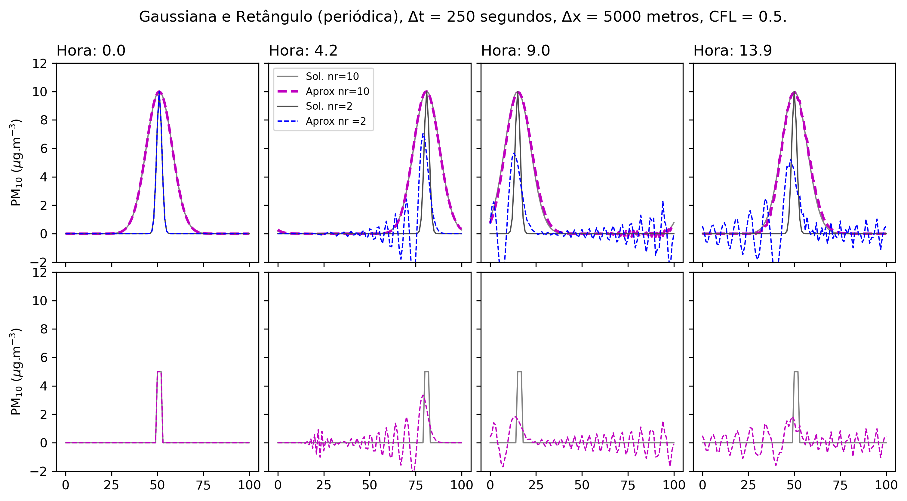
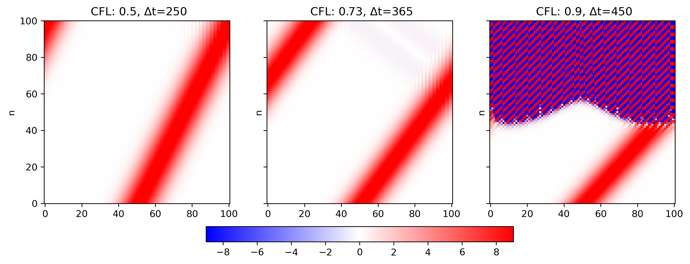
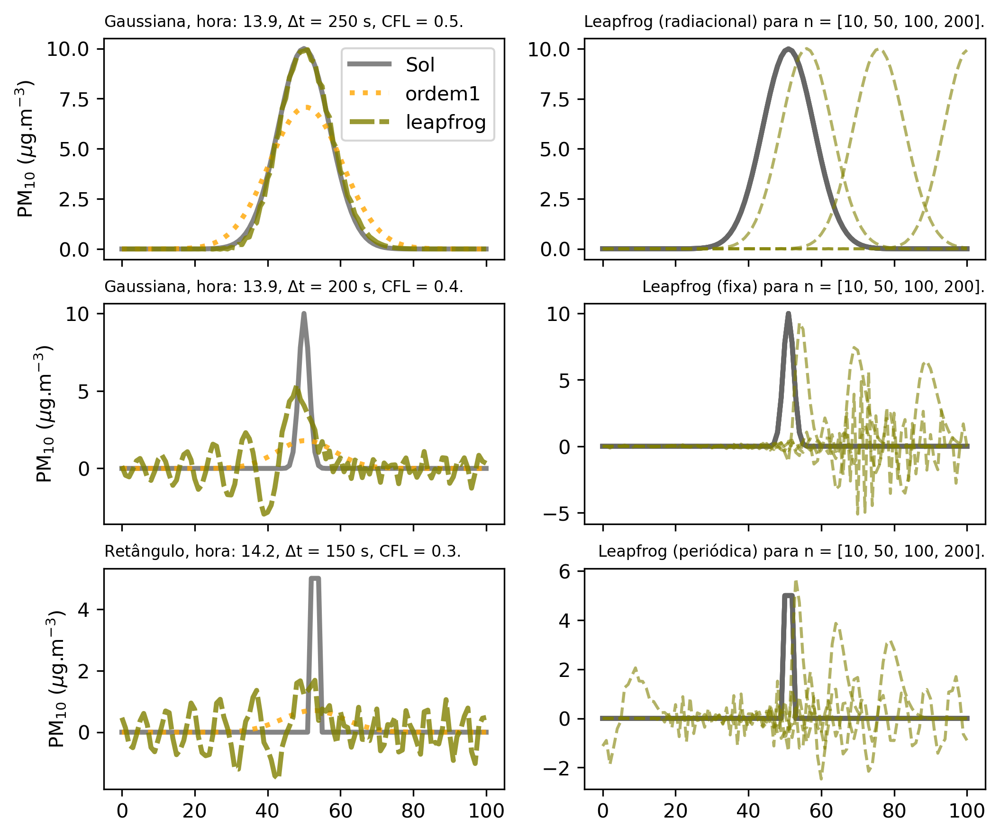
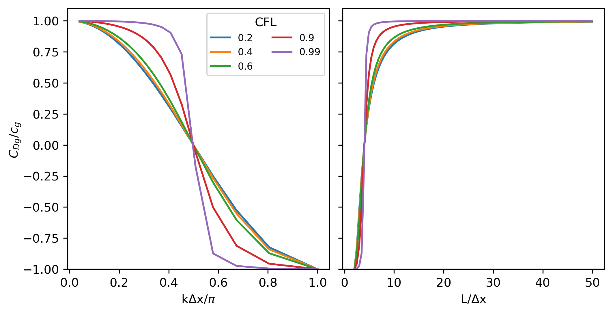
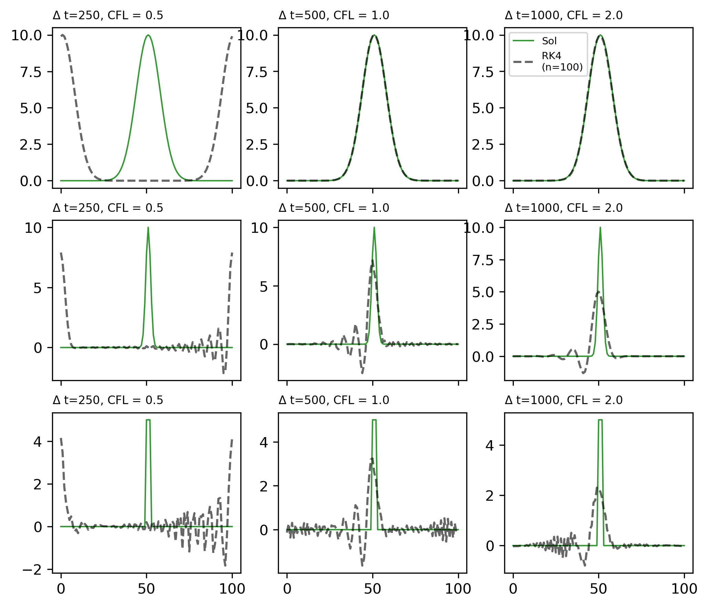

# 1. Introdução
O transporte das espécies químicas na atmosfera e as propriedades das massas de ar são afetadas pelo movimento na escala global, baixando até níveis de alta resolução em milímetros. A física deste fenômeno é de interesse para entender o impacto da natureza nas atividades humanas e vice-versa. A ideia é conseguir um modelo muito representativo da realidade que mostra como as propriedades conservativas são transportadas pelos ventos, conhecido como advecção. Atualmente, os modelos numéricos usam aproximações para resolver o escoamento, também assimilam observações das estações meteorológicas para forçar o modelo a representar condições reais, mas com altos custos computacionais. Os métodos numéricos usados nos modelos tentam aproximar as soluções das equações de derivadas parciais. A aplicação do método para resolver a advecção de alguma propriedade conservativa no espaço e tempo tem como objetivo nove considerações [Rasch e Williamson, 1990, citado em @Brasseur2017]: 1) precisão, 2) estabilidade, 3) monotonicidade, 4) conservação, 5) transportabilidade, 6) localidade, 7) correlatividade, 8) flexibilidade e 9) eficiênci.

$$ 
\frac{\partial C}{\partial t} + U*\frac{\partial C}{\partial x} = 0 
$$ {#eq:advec}

Este trabalho apresenta as soluções numéricas relacionadas com o problema de transporte de um pulso inicial de poluição com vento constante, representado pela equação de advecção em 1D (@eq:advec). 
Os clássicos esquemas numéricos usados no modelo foram de ordem 1, leapfrog de ordem 2 (espaço e tempo), leapfrog de 4a ordem, Matsuno (método iterativo), Crank-Nicolson (método implícito) e finalmente um Runge Kutta de 4a ordem no tempo com um esquema de 4a ordem no espaço. Para resolver a @eq:advec o modelo precisou de condições iniciais e de fronteira; as equações Gaussiana e Retângulo foram usadas para calcular a condição inicial. 
O esquema *leapfrog* usou três condições de fronteira de tipo `fixa`, `radiacional` e `periódica`. Os demais esquemas numéricos somente usaram a condição periódica na fronteira, como se fosse uma esfera; onde $C(b, t) = C(a, t)$ considera que a onda entra na direita ($x = b$) e volta pela esquerda ($x = a$). Além da aplicação do esquema numérico, os resultados também são acompanhados da solução analítica ($C(x, t) = G(x-Ut)$) que corresponde à translocação da função na direção `x` para uma velocidade `U`. 

## 1.1 Esquemas numéricos usados
### Esquema de ordem 1
O método simples para resolver a @eq:advec para uma velocidade constante positiva é o esquema *Euler Forward*, ele aproxima a derivada do tempo com diferenças progressivas e no espaço com diferenças regressivas (FTBS, siglas em inglês). O esquema é regressivo no espaço devido à sinal positiva da velocidade `U` > 0, expressado: 
$$\frac{C^{n+1}_j - C^{n}_j}{\Delta t} = -U \frac{C^n_j - C^n_{j-1}}{\Delta x} $$ {#eq:or1}
A amplitude da onda pode diminuir conforme passa o tempo, fica igual à solução analítica quando o número de Courant ($\alpha=\frac{U\Delta t}{\Delta x}$) é igual a 1. No entanto, se $\alpha$ <1, a solução apresenta difusão com atenuação da amplitude da onda. 
O método é monotônico (preserva o sinal), mas com pouca precisão por ser de ordem 1.

### Método leapfrog
O esquema *leapfrog* está caracterizado por ser de segundo ordem no tempo, baseado na aproximação da equação de advecção centrada no tempo e espaço, expresado como segue:
$$ \frac{C^{n+1}_j - C^{n-1}_j}{2\Delta t} = -U*\frac{C^n_{j+1} - C^n_{j-1}}{2\Delta x} $$ {#eq:or1}
Em condições estáveis do número de Courant ($\alpha < 1$), a aproximação mostra uma preservação da amplitude da onda ao longo do tempo, com $\alpha = 1$ a solução é exata. No entanto, para ondas curtas pode gerar dispersão computacional como erros de fase com oscilações espúrias (@Fig:1). A análise de dispersão para diferentes comprimentos de onda (L) explica este comportamento, assim temos que a função retângulo tem 2$\Delta$x = L e as duas gaussianas com maiores L (entre 10$\Delta x$ e 50$\Delta x$). Se substituímos a discretização do método *leapfrog* na solução da onda temos $C^n_j=C_0e^{ik(j\Delta x-C_Dn\Delta t)}$, obtemos $C_D/c = \frac{1}{\alpha k\Delta x}arcsin[\alpha sin(k\Delta x)]$, onde C$_D$ é a velocidade de fase computacional em função do número de onda $k$ que depende da resolução de $\Delta x$; as diferenças finitas no espaço geram a dispersão computacional [@Doos2020]. Conforme os mesmos autores, também temos a velocidade de grupo $C_{Dg}$ expressado em relação com a velocidade de fase ($c$) que é mostrado na @eq:dleap
$$\frac{C_{Dg}}{c_g}=\frac{cos(k\Delta x)}{\sqrt{1-[\alpha sin(k\Delta x)]^2}}. $${#eq:dleap}

{#fig:1}

### Esquema de 4o ordem
O método *leapfrog* é de segundo ordem no tempo e espaço. Dele, consideramos a aproximação da derivada no tempo e modificamos a parte da derivada no espaço com uma aproximação de 4o ordem [@Doos2020], então temos a @eq:4o $$\frac{C^{n+1}_j-C^{n-1}_j}{2\Delta t}+U\frac{C^n_{j-2}-8 C^n_{j-1}+8 C^n_{j+1}-C^n_{j+2}}{12\Delta x}=0 $${#eq:4o}
Se consideramos o análise de estabilidade de von Neumann, a discretização leva:
$$ g(k) = -i \frac{\alpha}{6} \left[8 sin(k\Delta x) - sin(2k\Delta x)\right] 
   \pm \{1 - \left[\frac{\alpha}{6}\left[8 sin(k\Delta x)-sin(2k\Delta x)\right]\right]^2 \}^{1/2}
$$ {#eq:v4o} onde $i=\sqrt{-1}$ e $k$ o número de onda. O esquema fica estável se $$\alpha < \frac{6}{8sin(k\Delta x)-sin(2k\Delta x))} $${#eq:s4o} para $\alpha$ < 0,73 [@Doos2020] e instável para valores maiores como ilustra a @Fig:2. 

{#fig:2}

### Método iterativo (esquema Matsuno)
Este método é iterativo com algoritmos explícito-implícito que tem precisão de primeiro ordem no tempo e de segundo ordem no espaço [@Brasseur2017; @Doos2020]. O primeiro passo é calcular o valor intermediário (nosso caso $C^*_j$) de pulso de poluição transportada no seguinte tempo $n+1$ com o uso do esquema simple de aproximação *Euler forward* (FTCS ou *Forward Time Centred Space*). O valor calculado logo é inserido na aproximação da derivada do espaço, com isso encontramos a seguinte expressão:

$$
C^{n+1}_j=C^n_j-\frac{\alpha}{2}\left(C^n_{j+1}-C^n_{j-1}\right)+\left(\frac{\alpha}{2}\right)^2\left( C^n_{j+2}-2C^n_j+C^n_{j-2}\right) 
$${#eq:mat}

### Método implícito (esquema Crank-Nicolson)
O método implícito escolhido para aproximar a @eq:advec corresponde ao esquema Crank-Nicolson. Este método é semi-implícito desde que alguns termos na direita são avaliados no tempo $n+1$ e outros em $n$, a expressão da @eq:crank ilustra a característica semi-implícita do método [@Jacobson2005],
$$C^{n+1}_j-C^{n}_j=- \frac{\alpha}{2}\left[\frac{C^{n+1}_{j+1}-C^{n+1}_{j11}}{2}+\frac{C^n_{j+1}-C^n_{j-1}}{2} \right] $${#eq:crank} dando forma podemos encontrar uma expressão de matrizes, como segue
$$-rC^{n+1}_{j-1}+C^{n+1}_j+rC^{n+1}_{j+1}=rC^{n}_{j-1}+C^{n}_j-rC^{n}_{j+1}$${#eq:matr}
$$ \begin{bmatrix}
1  & r & ... & 0\\
-r & 1 & r   &  \\
: & : & :   & : \\
  & -r & 1  & r \\
0 & 1 &  -r  & 1
\end{bmatrix} 
\begin{bmatrix}
C_0\\
C_1\\
...\\
C_{j-1}\\
C_j
\end{bmatrix}^{n+1} = 
\begin{bmatrix}
1  & -r & ... & 0\\
r  & 1 & -r   &  \\
: & : & :   & : \\
  & r & 1  & -r \\
0 &  &  r  & 1
\end{bmatrix}
\begin{bmatrix}
C_0\\
C_1\\
...\\
C_{j-1}\\
C_j
\end{bmatrix}^n
$$
onde $r=\frac{\alpha}{4}$ ($\alpha$ como número de Courant) no sistema de matrizes da forma $A.C^{n+1}=B.C^n$; este problema pode ser resolvido com os pacotes de `scipy.sparse` (e.g. `spsolve` e construído com `spdiags`) do programa `Python`.

### Método Runge Kutta de 4a ordem no tempo e espaço
O método clássico explícito *Runge-Kutta* de quarto ordem (RK4) tem como solução no tempo $n+1$ com a @eq:rk4 [@Randall2021],
$$C^{n+1}=C^n+\frac{\Delta t}{6}\left[k_1+k_1+2k_2+2k_3+k_4\right] $${#eq:rk4} onde $k_1=f(C^n, n\Delta t)$, $k_2=f(C^n +\frac{k_1\Delta t}{2},(n+1/2)\Delta t)$, $k_3=f(C^n +\frac{k_2\Delta t}{2},(n+1/2)\Delta t)$, $k_4=f(C^n +k_3\Delta t,(n+1)\Delta t)$. O método explícito RK4 é mais estável que o algoritmo *Euler progressivo*. Este método RK (ordem 3) é usado no modelo *Weather Research and Forecasting* (WRF) como aproximação da discretização do tempo; depois do último passo do tempo a microfísica é calculada para assegurar condições de saturação adequadas ao final do passo do tempo [@Skamarock2019].

# 2. Descrição da metodologia
O desenvolvimento do exercício considera dois tipos de funções, chamados Gaussiana e Retângulo. A função gaussiana está centrada em j=51, com decaimento exponencial dado por `nr` (número de pontos) onde a amplitude da perturbação segue a expressão da @eq:gau $$ C(x,0) = C_{j,0} = C_0 \exp[\frac{-(j\Delta x - 51\Delta x)^2}{(nr*\Delta x)^2}], $${#eq:gau} a função retângulo também está centrada na grade unidimensional com amplitude $2\Delta x$, como é ilustrado na @fig:1 (abaixo para o tempo n=0). A malha tem espaçamento uniforme $x_j$ com $\Delta x = 5000 m$, $x_j = j\Delta x$, com $j=1$, $Nx = 101$. A velocidade $U$ é constante e igual a 10 m/s. A integração para cada esquema considerou o tempo suficiente para que a perturbação inicial volte para a parte central da malha no caso da fronteira periódica; calculado em 14 horas aproximadamente.

 As soluções analíticas foram encontradas para acompanhar os resultados das aproximações numéricas para os diferentes esquemas. As condições de fronteira usadas para cada esquema são mostradas na [@Tbl:1]. O código usado para desenvolver cada esquema de aproximação foi desenvolvido na linguagem de `Python`. As condições periódicas foram um desafio para escrever o código em Python, sendo mais simples para o esquema de ordem 1 e complexas para os demais. A seção [Apêndice A](#apêndice-a) mostra um resumo das principais partes do código escrito para resolver os diferentes esquemas numéricos. O *script* completo está disponível no repositório de GitHub do autor, na pasta "Exercicio_1" no link a seguir **[functions.py](https://github.com/adelgadop/Modelagem/blob/main/Exercicio_1/functions.py)**.

Esquema         Condição de fronteira
--------        ---------------------
Ordem 1         Periódica
Leapfrog        Fixa, radiacional e periódica
Ordem 4         Periódica
Matsuno         Periódica
Crank-Nicolson  Periódica
RK4             Periódica

: Esquemas usados para os experimentos de aproximação da equação de advecção. {#tbl:1} 

# 3. Resultados e discussão
Os experimentos (1 até 6) mostram diferenças (@fig:3) com a solução analítica (em cinza), algumas delas (e.g., ordem 1 e Matsuno) com maior atenuação da amplitude que outras (RK4, leapfrog, ordem 4 e Crank-Nicolson). O esquema de ordem 1 (experimento 1) e Matsuno (experimento 4) apresentaram o mesmo comportamento depois de 14 horas de simulação da advecção com velocidade constante para a direita do domínio 1D. A aproximação do esquema de ordem 1 (marcados com pontos amarelos) mostra resultados diferentes com o esquema de leapfrog de ordem 2 (experimento 3). Na direita da  @fig:4 temos resultados da integração com o método leapfrog para diferentes condições de fronteira (e.g., radiacional, fixa e periódica). A condição fixa acumula erros ao longo do tempo para comprimentos de onda longa e curta. Conforme o análisis de estabilidade de von Neumann, o método leapfrog é não dissipativo; apesar de ter valores de CFL < 1, acontece a dispersão computacional, principalmente para as ondas curtas que leva soluções numéricas espúrias (mostrado no centro e abaixo da @fig:4), com decréscimos na velocidade de fase conforme à relação entre longitude da onda e o espaçamento ($\Delta x$) como é mostrado no análisis da @fig:5. Um comprimento de onda $L=2\Delta x$ como a função retângulo vai apresentar valores negativos em $C_{Dg}/c_g$ para diferentes números de Courant (CFL). Em geral, o método leaprog é caracterizado por ser estável quando o CFL < 1 e dispersivo [@Brasseur2017; @Doos2020]. 

{#fig:3}

{#fig:4}

{#fig:5}

A derivada no espaço do experimento 2 (leapfrog) foi modificada para um esquema de 4a ordem (experimento 3), os resultados mostram melhoras na amplitude da onda se comparar com a solução analítica e soluções com leapfrog para ondas curtas do experimento 2. A desvantagem desta aproximação de 4a ordem foi mostrada na @fig:2 onde o CFL > 0,73 gera soluções instáveis, resultados que são similares com o encontrado na Figura 4.10 de @Doos2020.
O método implícito com o esquema Crank-Nicolson (experimento 5) mostra resultados estáveis para a gaussiana longa, mas tem limitações para ondas curtas (gaussiana curta e retângulo) com soluções de atenuação da amplitude. Finalmente, o método RK4 no tempo com um esquema de 4ª ordem no espaço (experimento 6) mostra resultados muito parecidos com a solução analítica para ondas longas. As ondas curtas depois de 14 horas de integração mostram atenuação da amplitude da onda. O esquema é estável e tem boa aproximação em conservar a amplitude da onda em comparação com outros esquemas apresentados. A @fig:6 mostra que as ondas longas são conservadas mesmo que o CFL seja maior que 1 (por exemplo CFL = 2 na parte superior à direita da figura), não acontece com as ondas curtas onde as amplitudes são atenuadas ao longo da integração no tempo.

{#fig:6}

# 4. Conclussões preliminares
Este trabalho mostrou as soluções numéricas relacionadas com o problema de transporte de um pulso inicial de poluição com vento constante, representado pela equação de advecção em 1D. 
Os esquemas numéricos usados precisam de condições iniciais e de fronteira; onde as equações gaussiana e retângulo foram aplicadas para gerar as condições iniciais e todos os esquemas apresentaram condições de fronteira de tipo periódica. Somente o esquema leapfrog mostrou resultados para condições de fronteira tipo fixa, periódica e radiacional.
Além da aplicação do esquema numérico, os resultados também foram acompanhados da solução analítica. 

Em geral, as funções que representam ondas curtas como condições iniciais mostraram resultados com oscilações espúrias, o que mostra a importância da resolução do modelo devido que a relação da dispersão numérica pode ocorrer através da influência da discretização no tempo e no espaço. A resolução do modelo como o $\Delta x$ é muito importante para resolver os fenômenos meteorológicos que podem representar comprimentos de onda diferentes (e.g., 20 km e 100 km); como foi conversado na aula, se o modelo tem uma resolução espacial $\Delta x$ = 5 km, pode resolver e representar fenômenos de 100 km, mas se o comprimento da onda do fenômeno é 4$\Delta x$ o modelo vai experimentar problemas. Além disso, os valores de número de Courant < 1 (definido como CFL ou $\alpha$ neste trabalho) podem evitar problemas de instabilidade numérica como acontece com o esquema de ordem 4 que precisa de CFL menores. Em conclusão, a avaliação do esquema para resolver uma aproximação de advecção precisa de dois indicadores como a estabilidade do valor de CFL e a relação de dispersão. Este último indicador mostra se o esquema com uma resolução espacial específica vai experimentar oscilações espúrias (e.g., concentrações negativas de poluentes), não monotônicas, e que vão afetar o desempenho dos modelos eulerianos em resolver o transporte das concentrações indicadoras da qualidade do ar.

# Bibliografia
<div id="refs"></div>

# Apêndice A
Esta seção mostra algumas partes do código escrito em `Python`, disponibilizados no arquivo **[functions.py](https://github.com/adelgadop/Modelagem/blob/main/Exercicio_1/functions.py)** no *[GitHub](https://github.com/adelgadop)* do autor.

```python
# ordem 1
C[0, n]  = C[-1, n-1]

# leapfrog
C[-1, n] = C[ 99, n-1] 
C[ 0, n] = C[-1, n-1]

# ordem 4
C[-2, n] = C[-2, n-2] - CFL*(C[-1, n-1] - C[-3, n-1])
C[1,n]   = C[1, n-1] - CFL*(C[1, n-1]- C[0, n-1])
C[-1, n] = C[99, n-2] - CFL/6*(8*(C[100,n-1]-C[98,n-1])-(C[1,n]-C[97,n-1]))
C[ 0, n] = C[100, n-2] - CFL*(C[1, n] - C[99, n-1])

# Matsuno
u[-1, n] = C[-1, n-1] - CFL*(C[-1, n-1]- C[-2, n-1])
C[-1, n] = C[-1, n-1] - CFL*(u[-1, n-1] - u[-2,n-1])
u[0, n] = u[-1, n-1]
C[0, n] = C[-1, n-1]

# Crank
def crank_matrix(x, CFL, uc):
    """
    Return matrices A and B for advection equations
    -----------------------------------------------
    x      : linear space with Nx points
    r      : CFL/2
    uc     : is a Crank-Nicolson parameter equals to 1/2
    """
    import scipy.sparse as sp
    uns   = np.ones(len(x))
    r     = uns*CFL/2
    diags = (-1, 0, 1)  # -1 low diagonal, 0 main diagonal, 1 upper diagonal
    A = sp.spdiags( [-uc*r, uns, uc*r], diags, len(x), len(x) )
    A = sp.lil_matrix(A)
    B = sp.spdiags( [(1-uc)*r, uns, -(1-uc)*r], diags, len(x), len(x) )
    B = sp.lil_matrix(B)
    
    # periodic
    A[0,-1] = -CFL/4
    A[-1,0] = CFL/4
    B[0,-1] = CFL/4
    B[-1,0] = -CFL/4
    return A.tocsr(), B.tocsr()  # A.toarray()

# Runge-Kutta 4o ordem no espaço
def deriv(c,U,dx):
    """
    Derivada RK4
    """
    dc = np.zeros(len(c))
    p = U/(2*dx)
    dc[2:-2] = -(U/(12*dx))*(8*(c[3:-1]-c[1:-3]) - (c[4:] - c[:-4]))
    dc[1]  = -p*(c[2] - c[-1])
    dc[-2] = -p*(c[-1]- c[-3])
    dc[0]  = -p*(c[1] - c[-2])
    dc[-1] = -p*(c[1] - c[-2])
    return dc

# Aproximações numéricas
# ----------------------
for n in range(1, Nt):
    if aprox == "ordem1":
        C[1:, n] = C[1:, n-1] - CFL*(C[1:, n-1]- C[:-1, n-1])

    elif aprox == "leapfrog":  # ok
        if n == 1:  # Euler 2d order scheme for the first time step
            C[1:-1,n] = C[1:-1,n-1] - CFL/2*(C[2:,n-1] - C[:-2,n-1])
        elif n > 1:
            C[1:-1, n] = C[1:-1, n-2] - CFL*(C[2:, n-1] - C[:-2, n-1])
    # Condição de fronteira
    # ---------------------
        if cond_front == 'fixa': 
            C[[0,-1], n] = [0,0]
        elif cond_front == 'periódica': 
            C[-1, n] = C[ 99, n-1] 
                C[ 0, n] = C[-1, n-1] 
        elif cond_front == 'radiacional':
                C[-1, n] = C[-1, n-1] - CFL*(C[-1, n-1]- C[-2, n-1])

    elif aprox == "ordem4": 
        if n == 1:    # Euler 2d order scheme for the first time step
            C[1:-1,n] = C[1:-1,n-1] - CFL/2*(C[2:,n-1] - C[:-2,n-1])
            C[0,n] = C[-1,n-1]
        elif n > 1:
            C[2:-2, n] = C[2:-2,n-2] - \
              CFL/6*(8*(C[3:-1,n-1]-C[1:-3,n-1])-(C[4:,n-1]-C[:-4,n-1]))

    elif aprox == "Matsuno":
        # Start with Euler forward
        u[1:-1,n] = C[1:-1, n-1] - CFL*(C[1:-1, n-1] - C[0:-2, n-1])
        C[1:-1,n] = C[1:-1, n-1] - CFL*(u[1:-1, n-1] - u[0:-2, n-1])

    elif aprox == "Crank":
        # spsolve: solve the sparse linear system Ax=B
        # A*C[:,n] = B*C[:, n-1]  
        C[:, n] = spsolve(A, B*C[:, n-1])
    
    elif aprox == "RK4":
        """
        Runge-Kutta scheme
        ------------------
        """
        k1 = deriv(c            , U, dx)
        k2 = deriv(c + dt*0.5*k1, U, dx)
        k3 = deriv(c + dt*0.5*k2, U, dx)
        k4 = deriv(c + dt*k3    , U, dx)

        C[:,n] = c = c + (k1 + 2*k2 + 2*k3 + k4)*dt/6   
```


