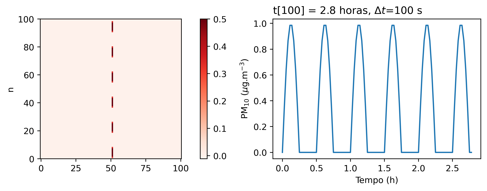

# 1. Introdução
xxxx

$$ 
\frac{\partial C}{\partial t} + U*\frac{\partial C}{\partial x} = 0 
$$ {#eq:advec}

Este trabalho apresenta x. 

# 2. Descrição da metodologia
xxx 

# 3. Resultados
A @Fig:1

{#fig:1}

xxx

# 4. Discussão dos resultados
xxx

# Bibliografia

# Apêndice A
xxx

