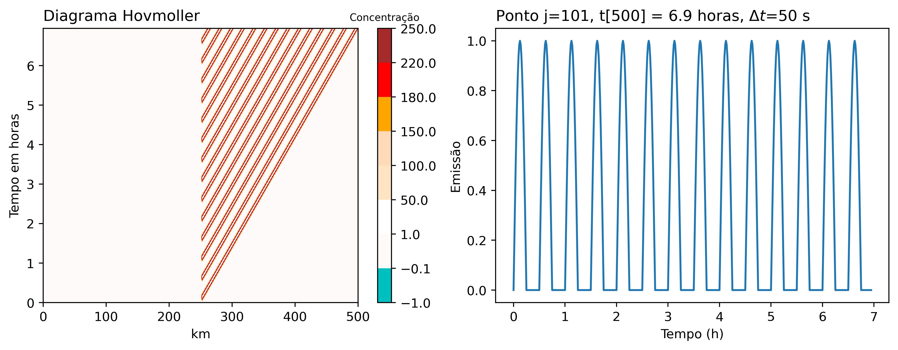
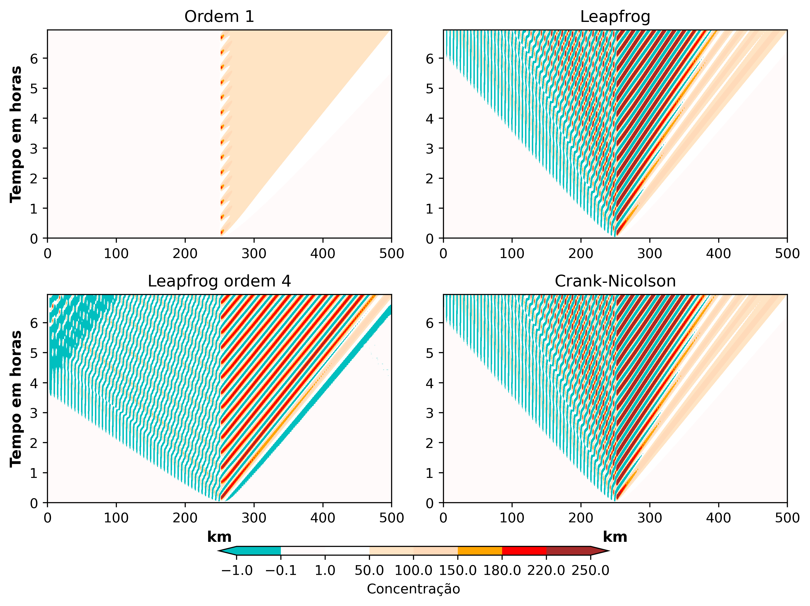

# 1. Introdução
As fontes de emissão podem variar ao longo do tempo como acontecem em diferentes atividades humanas como industriais, residencial e transporte rodoviário. O exercício 2 considera analisar uma fonte de poluição pontual (p.e., chaminé) que emite em forma de pulso senoidal com o mesmo campo básico de velocidade do vento (U = 10 m/s) do exercício 1 (equação de advecção linearizada). Os cálculos consideram resultados da solução analítica e também dos métodos numéricos (Euler progressivo-regressivo, leapfrog 2ª ordem, leapfrog 4ª ordem no espaço e implícito como o esquema Crank-Nicolson). As condições iniciais do campo são nulos e somente a fonte pontual senoidal gera emissões na metade do dominio 1D. Alguns métodos numéricos geraram oscilações do modo computacional que foram filtrados. Outros experimentos foram considerados para o método implícito com a variação da resolução do tempo $\Delta t$ para obter diferentes números de Courant (CFL) para valores de 1, 2 e 4. Os resultados dos experimentos são importantes para conhecer as aplicações dos filtros nos modelos eulerianos de qualidade do ar considerando que as unidades das concentrações dos poluentes sempre são positivas pelo que é importante preservar a monotonicidade física do fenômeno.

$$
\frac{dC}{dt}=F(C,t)
$${#eq:ode}

$$
C(t_{n+1}) = C(t_n) + \int_{t_n}^{t_{n+1}}F(C, t)dt
$${#eq:ode2}

A aplicação de equações diferenciais ordinarias (ODEs, siglas em inglês) que describe a evolução do poluente no tempo é mostrado na @eq:ode que pode ser resolvido com a interpretação geométrica como mostra a @eq:ode2 [@Brasseur2017]. Além disso, o desenvolvimento do exercicío 2 precisa das equações do movimento da onda ao longo do tempo e espaço causado pela advecção desde a fonte. A forma geral para ondas transversais de propagação considera a $y = f(x - vt)$ onde $v$ é a velocidade. As ondas harmônicas tem a forma de $\sin(kx - \omega t)$ ou $\cos(kx - \omega t)$ onde $\omega = 2\pi / T$ para $T$ como período e o número de onda $k=\frac{2\pi}{\lambda}$ para $\lambda$ como comprimento de onda em metros.

## 1.1 Filtros Robert-Asselin
Os filtros de Robert-Asselin podem remover oscilações do modo computacional para os esquemas como o método leapfrog [@Doos2020]. Neste trabalho foram considerados os filtros no espaço (@eq:1) e tempo (@eq:2).

$$
C_j = C_j + \gamma (C_{j-1} - 2C_j + C_{j+1})
$${#eq:1}

$$
C^{n} = C^n + \gamma (C^{n-1} - 2C^n + C^{n+1})
$${#eq:2}

# 2. Descrição da metodologia
As equações do exercício 2 considera a fonte com pulso senoidal na metade do campo de advecção, governado pela equação $\frac{\partial C}{\partial t}+U \frac{\partial C}{\partial x}=F$ onde $F=F(x,t)$, considerando  $F(i=100, n\Delta t)= sin(\omega .n\Delta t)$ para n = 0, ... N$_{max}$ se $sin(\omega .n.\Delta t) > 0$ e $F(i=100, n\Delta t)=0$ caso $sin(\omega .n\Delta t)< 0$ como $\omega = \frac{2\pi}{1800}$ $s^{-1}$. A equação com derivadas parciais foi transformada em equação diferencial ordinária com a solução geral [@Brasseur2017], com isso temos $\frac{dx}{ds}=U$, 
$$
\frac{dt}{ds} = 1 
$${#eq:dt}

$$
\frac{dC}{ds} = F(x=100, t).
$${#eq:dC}

Podemos encontrar a relação entre [@eq:dt; @eq:dC] como segue

$$
dC = F(x=100, t) dt
$$

$$
\int dC = \int _{t_n}^{t_n+1} F(x=100, t)\,dt  
$$

$$
C^{n+1} = C^{n} - \frac{1}{\omega}[\cos(\omega \,t_{n+1}) - \cos(\omega \,t_n)].
$${#eq:int}

Esta solução analítica pode ser propagada no espaçõ como $f(x-U\,t)$, considerando nosso caso que a propagação acontece desde a metade da grade. Este trabalho considerou representar a solução analítica com a função da onda harmônica,

$$
C^{n+1}_x = C^{n}_x - \frac{1}{\omega}[\cos(-x\,k + \omega \,t_{n+1}) - \cos(-x\,k + \omega \,t_n)]
$$

com isso, os resultados negativos foram removidos e substituídos por zero para preservar a monotonicidade do fenómeno físico. A seção [Apêndice A](#apêndice-a) mostra um resumo das principais partes do código escrito para resolver os diferentes esquemas numéricos. A discretização da fonte $F(x=100, t)$ segue uma aproximação tipo *Euler forward* a partir da equação diferencial ordinária [@Brasseur2017],

$$
\frac{d C}{dt}=F(C,t)
$$

$$
\frac{C^{n+1}-C^n}{\Delta t}=F(C^n, t_n)
$$
onde $\Delta t = t_{n+1}-t_n$ o passo de tempo no método numérico, então nós temos

$$
C^{n+1}=C^n + \Delta t\,F^n.
$$

Também temos como outra opção o esquema implícito trapezoidal como segue

$$
C^{n+1}=C^n+\frac{\Delta t}{2}(F^{n+1}+F^n).
$$

No esquema de segundo ordem como leapfrog, a discretização é a seguinte
$$
C^{n+1}=C^{n-1} + 2\,\Delta t\,F^n.
$$

# 3. Resultados
{#fig:1}

Os resultados da propagação da fonte como solução analítica é mostrado no diagrama Hovmoller da @Fig:1, onde também podemos notar (direita da figura) a variação senoidal da fonte  ao longo do tempo. A propagação acontece no lado direito do centro do domínio da grade devido à velocidade de sinal positivo. A magnitude da concentração é explicado devido à integração mostrada na @eq:int. A solução analítica foi comparada com as aproximações numéricas mostradas na @Fig:2, os esquemas permitem que as perturbações possam sair do domínio sem que aconteça reflexão devido à implementação do esquema *Euler forward-backward* no final na direita da grade. O esquema de ordem 1 da figura mostra concentrações menores de propagação se comparar com a solução analítica. Os demais esquemas apresentam oscilações na retaguarda que é contraditório ao comportamento físico do fenómeno da advecção para a direita. Os resultados da direita do centro do domínio para o esquema de 4ª ordem mostram valores mais aproximados à solução analítica, no entanto com oscilações numéricas negativas. Então para tornar o resultado mais realista, a @Fig:3 mostra resultados onde os valores da esquerda do centro do domínio foram filtrados no tempo e espaço com as [@eq:1; @eq:2] de Robert-Asselin. Os resultados dos esquemas de leapfrog e Crank-Nicolson tem semelhanças no modo da propagação depois da filtragem.

Os resultados dos experimentos para valores de CFL $\geq$ 1 com o esquema Crank-Nicolson são mostrados na @Fig:4. A parte superior as aproximações apresentam oscilações na esquerda do centro da grade. Somente, a aplicação de filtros para remover as oscilações foi eficaz para CFL menores que 2. A aproximação com um $\Delta t = 1000$ s gera instabilidade numérica.

{#fig:2}

{#fig:3}

{#fig:4}

# 4. Discussão dos resultados
A aproximação do ordem 1 progressivo no tempo e regressivo no espaço é um importante esquema que não precisa de filtros devido à simplicidade do método. No entanto, o esquema é difusivo pelo que as concentrações são subestimadas se comparar com a solução analítica. Outros esquemas como leapfrog (2ª e 4ª ordem) e Crank-Nicolson geram resultados com oscilações que contradicem o fenómeno físico da solução analítica, pelo que a aplicação do filtros no espaço e tempo é importante para preservar a monotonicidade do fenómeno.

# Bibliografia
<div id="refs"></div>

# Apêndice A

A solução analítica considerou a aplicação da equação da onda harmônica como segue

```python
Nx, dx, Nt, dt, U  = 201, 2500, 501, 50, 10, 
x, _ = np.linspace(0, (Nx-1)*dx, Nx, retstep = True)
t, _ = np.linspace(0, (Nt-1)*dt, Nt, retstep = True)
CFL     = U*dt/dx   
C_s = np.zeros((Nx, Nt))
T, X = np.meshgrid(t, x)

for n in range(1, Nt):
    om=2*np.pi/1800
    k= om/U
    j = int(100 + U*t[n]/dx)
    C_s[100:j, n] = C_s[100:j, n-1] - (np.cos(-x[100:j]*k + om*t[n])/om - \
                     np.cos(-x[100:j]*k + om*t[n-1])/om) 

C_s[C_s <= 0] = 0
```
A função do Euler progressivo no tempo e regressivo no espaço é mostrado em Python a continuação
```python
C = np.zeros((Nx, Nt))
F = C.copy()

def euler_back(C, n, CFL, dt, F):
    C[1:, n] = C[1:, n-1] + F[1:, n-1]*dt - CFL*(C[1:, n-1]- C[:-1, n-1])
    return C

for n in range(1, Nt):
    F[100, n-1] = wave(t,n-1)
    # advecção ordem 1
    C = euler_back(C, n, CFL, dt, F)
```
para `C` como matriz de Nx e Nt pontos de grade no espaço e tempo, respetivamente. O exercício 1 considerou uma resolução espacial $\Delta x = 5000$; mas para representar o comprimento de onda, a resolução mudou para $\Delta x = 2500$ e um $\Delta t = 50$ segundos. A função leapfrog considera para o primer passo de tempo o esquema Euler progressivo-regressivo, depois o código considera o modo radiacional:

```python
def leap2(C, n, CFL, dt, F, f_space=False, f_time = False, alfa=0.105):
    if n == 1:
    # Euler
        C = euler_back(C, n, CFL, dt, F)   

    elif n > 1:
        C[1:-1,n] = C[1:-1,n-2]+2*dt*F[1:-1,n-1]-CFL*(C[2:, n-1]-C[:-2,n-1])   
        # radiacional
        C[-1, n] = C[-1, n-1] + F[-1,n-1]*dt - CFL*(C[-1, n-1]- C[-2, n-1])
    
    # Filtro Robert-Asselin
    C = filtro(C, alfa, f_space, f_time)
   
    return C

C_l = np.zeros((Nx, Nt))
C_lf = C_l.copy()
F = C_l.copy()

for n in range(1, Nt):
    F[100,n-1] = wave(t,n-1)
    C_l = leap2(C_l, n, CFL, dt, F, f_space=False, f_time = False, alfa=0.105)
    
    C_lf = leap2(C_lf, n, CFL, dt, F, f_space=True, f_time=True)
```
A continuação a função de leapfrog 4ª ordem mostra os modos radiacionais com aplicação de Euler no primeiro passo de tempo:

```python
def ordem4(C,n, CFL, dt, F, f_space=False, f_time = False, alfa=0.105):
    # Aprox leapfrog 4a ordem
    # --------------
    if n == 1:
        # Euler
        C = euler_back(C, n, CFL, dt, F)  

    elif n > 1:
        C[2:-2, n] = C[2:-2,n-2] + F[2:-2,n-1]*2*dt - /
                     CFL/6*(C[:-4,n-1] - 8*C[1:-3,n-1] + 8*C[3:-1,n-1] - C[4:,n-1])
        # radiacional
        C[-2, n] = C[-2, n-1] + F[-2,n-1]*dt - CFL*(C[-2, n-1] - C[-3, n-1])
        C[-1, n] = C[-1, n-1] + F[-1,n-1]*dt - CFL*(C[-1, n-1] - C[-2, n-1])
    
    # Filtro Robert-Asselin
    C = filtro(C, alfa, f_space, f_time)
    
    return C

C_4o = np.zeros((Nx, Nt))
C_4of = C_4o.copy()
F = C_4o.copy()

for n in range(1, Nt):
    F[100,n-1] = wave(t,n-1)
    # Não filtrado
    C_4o = ordem4(C_4o,n, CFL, dt, F)
    # Filtrado
    C_4of = ordem4(C_4of,n, CFL, dt, F, f_space=True, f_time=True)
```
Finalmente, o método implícito escolhido é o esquema Crank-Nicolson com as seguintes funções:

```python
def crank_matrix(CFL, x, uc=0.5):
    import scipy.sparse as sp
    uns   = np.ones(len(x))
    r     = uns*CFL/2
    diags = (-1, 0, 1)  # -1 low diagonal, 0 main diagonal, 1 upper diagonal
    A = sp.spdiags( [-uc*r, uns, uc*r], diags, len(x), len(x) )
    A = (sp.lil_matrix(A)).tocsr()
    B = sp.spdiags( [(1-uc)*r, uns, -(1-uc)*r], diags, len(x), len(x) )
    B = (sp.lil_matrix(B)).tocsr()

    return A, B

def crank(A, B, C, n, CFL, f_space=False, f_time = False, alfa=0.105):
    C[:, n] = spsolve(A, B*C[:, n-1])
    C[-1, n] = C[-1, n-1] - CFL*(C[-1, n-1] - C[-2, n-1])

    # Filtro Robert-Asselin
    C = filtro(C, alfa, f_space, f_time)
    
    return C
```
Com o fim de preservar a função de resolução do esquema Crank-Nicolson, a fonte discretizada foi sumada ao campo nulo, escrito em Python como segue:

```python
C_cr = np.zeros((Nx, Nt))
C_crf = C_cr.copy()
F = C_cr.copy()
A, B = crank_matrix(CFL, x)

for n in range(1, Nt):
    F[100,n-1] = wave(t, n-1)
    C_cr[:,n-1] = C_cr[:,n-1] + dt*F[:,n-1]
    C_cr = crank(A, B, C_cr, n, CFL, f_space=False, f_time = False)

    C_crf[:,n-1] = C_crf[:,n-1] + dt*F[:,n-1]
    C_crf = crank(A, B, C_crf, n, CFL, f_space=True, f_time = True)
```
Finalmente, o seguinte código em Python mostram os filtros Robert-Asselin que removem o modo computacional. Neste trabalho, somente foi aplicado até a mitade da grade devido a que o filtragem afeta significativamente os resultados de advecção da fonte.

```python
def filtro(C, alfa, f_space=False, f_time=False):
    """Filtro Robert-Asselin para remover o modo computacional

    Args:
        C (array): Campos nulos com a emissão na metade
        n (int): passo de tempo
        alfa (float, optional): Coeficiente.
        f_space (bool, optional): Filtro no espaço. Defaults to False.
        f_time (bool, optional): Filtro no tempo. Defaults to False.

    Returns:
        array: valores de C filtrados
    """
    # Filtro Asselin desde a mitade da grade
    if f_space == True:
        C[1:100,:] = C[1:100, :] + alfa*(C[:99,:] - 2*C[1:100, :] + C[2:101, :])
    
    if f_time == True:
        C[:100,1:-1] = C[:100,1:-1]+alfa*(C[:100,:-2] - 2*C[:100,1:-1] + C[:100,2:])
        
    else:
        pass
    
    return C
```


