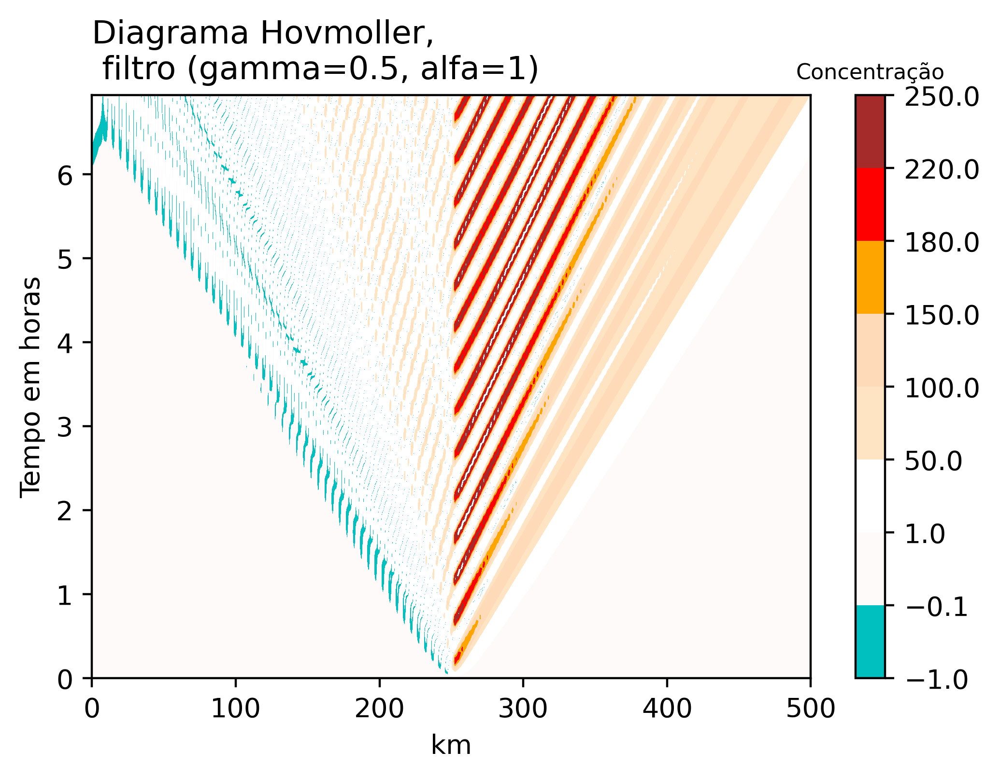

# 1. Introdução
As fontes de emissão podem variar ao longo do tempo como acontecem em diferentes atividades humanas como industriais, residencial e transporte rodoviário. O exercício 2 considera analisar uma fonte de poluição pontual (p.e., chaminé) que emite em forma de pulso senoidal com o mesmo campo básico de velocidade do vento (U = 10 m/s) do exercício 1 (equação de advecção linearizada). Os cálculos consideram resultados da solução analítica e também dos métodos numéricos (Euler progressivo-regressivo, leapfrog 2ª ordem, leapfrog 4ª ordem no espaço e implícito como o esquema Crank-Nicolson). As condições iniciais do campo são nulas e somente a fonte pontual senoidal gera emissões na metade do domínio 1D. Alguns métodos numéricos geraram oscilações do modo computacional que foram filtradas. Outros experimentos foram considerados para o método implícito com a variação da resolução do tempo $\Delta t$ para obter diferentes números de Courant (CFL) para valores de 1, 2 e 4. Os resultados dos experimentos são importantes para conhecer as aplicações dos filtros nos modelos eulerianos de qualidade do ar considerando que as unidades das concentrações dos poluentes sempre são positivas, pelo que é importante preservar a monotonicidade física do fenômeno.

$$
\frac{\partial C}{\partial t} + U\frac{\partial C}{\partial x}=F(x=101,t)
$$

$$
\frac{dt}{ds}=1; \frac{dx}{ds}=U; \frac{dC}{ds}=F(x=101, t)
$${#eq:ode}

A aplicação de equações diferenciais ordinárias (ODEs, siglas em inglês) que describe a evolução do poluente no tempo é mostrado na @eq:ode que pode ser resolvido com a interpretação geométrica como mostra a @eq:ode2 [@Brasseur2017]. Além disso, o desenvolvimento do exercício 2 precisa das equações do movimento da onda ao longo do tempo e espaço causado pela advecção desde a fonte. A forma geral para ondas transversais de propagação considera a $y = f(x - vt)$ onde $v$ é a velocidade.

## 1.1 Filtro Robert-Asselin-Williams
Os filtros de Robert-Asselin-Williams podem remover oscilações do modo computacional para os esquemas como o método leapfrog [@Doos2020]. Neste trabalho foram considerados os filtros no espaço (@eq:1) e tempo (@eq:2). Onde $\gamma$ é o fator de filtro de Robert-Asselin que pode estar entre 0,01 e 0,1 conforme @Doos2020. Outro autor faz menção em usar $\gamma = 0,5$ [@Randall2021]. Quando $\alpha = 1$ o filtro tem forma de Robert-Asselin. O autor [Williams (2009), citado em @Doos2020] recomenda o valor de $\alpha = 0,53$ para reduzir o impacto das oscilações espúrias. 

$$
Cff_j = Cf_j + \frac{\gamma \alpha}{2} (Cff_{j-1} - 2Cf_j + C_{j+1})
$${#eq:1}
$$
Cf_{j+1} = C_{j+1} - \frac{\gamma (1-\alpha)}{2} (Cff_{j-1} - 2Cf_j + C_{j+1})
$$

$$
C^{n} = C^n + \frac{\gamma \alpha}{2} (C_{ff}^{n-1} - 2C_f^n + C^{n+1})
$${#eq:2}

$$
C_f^{n+1} = C^{n+1} - \frac{\gamma (1-\alpha)}{2} (C_{ff}^{n-1} - 2C_f^n + C^{n+1})
$$

# 2. Descrição da metodologia
O exercício 2 considera que a fonte tem um pulso senoidal de emissão na metade do campo de advecção, governado pela equação $\frac{\partial C}{\partial t}+U \frac{\partial C}{\partial x}=F$ onde $F=F(x,t)$, considerando  $F(i=101, n\Delta t)= sin(\omega .n\Delta t)$ para n = 0, ... N$_{max}$ se $sin(\omega .n.\Delta t) > 0$ e $F(i=101, n\Delta t)=0$ caso $sin(\omega .n\Delta t)< 0$ como $\omega = \frac{2\pi}{1800}$ $s^{-1}$. A equação com derivadas parciais foi transformada numa equação diferencial ordinária com solução geral [@Brasseur2017], com isso podemos ter duas relações entre a fonte no espaço e tempo como é expresado no desenvolvimento das integrais das [@eq:ode2; @eq:ode3] somo segue,
$$
C(t_{n+1}) = C(t_n) + \int_{t_n}^{t_{n+1}}F(x=101, t)dt
$${#eq:ode2}
$$
C(x_{101}) = C(x_{100}) + \int_{}^{\Delta x}F(x=101, t)dx.
$${#eq:ode3}

Com isso temos duas relações:

$$
C^{n+1} = C^{n} - \frac{1}{\omega}[\cos(\omega \,t_{n+1}) - \cos(\omega \,t_n)].
$${#eq:int}

$$
C_{x_{j+1}} = C_{x_j} - \frac{\Delta x}{U}\sin(\omega t).
$${#eq:int2}
ou similar na forma discretizada:
$$
U\frac{C_{x_{j+1}} - C_{x_j}}{\Delta x} = \sin(\omega t).
$$

Esta solução analítica pode ser propagada no espaço como $f(x-U\,t)$; para nosso caso a propagação acontece desde a metade da grade. Os resultados negativos foram removidos e substituídos por zero para preservar a monotonicidade do fenômeno físico. A seção [Apêndice A](#apêndice-a) mostra um resumo das principais partes do código escrito em Python para resolver os diferentes esquemas numéricos. A discretização da fonte $F(x=101, t)$ segue uma aproximação tipo *Euler forward* a partir da equação diferencial ordinária [@Brasseur2017], 

$$
\frac{d C}{dt}=F(C,t)
$$

$$
\frac{C^{n+1}-C^n}{\Delta t}=F(C^n, t_n)
$$
onde $\Delta t = t_{n+1}-t_n$ o passo de tempo no método numérico, então nós temos

$$
C^{n+1}=C^n + \Delta t\,F^n.
$$

Também temos como outra opção o esquema implícito trapezoidal como segue

$$
C^{n+1}=C^n+\frac{\Delta t}{2}(F^{n+1}+F^n).
$$

No esquema de segundo ordem como leapfrog, a discretização é a seguinte
$$
C^{n+1}=C^{n-1} + 2\,\Delta t\,F^n.
$$

A fonte foi discretizada conforme a equação do Exercício 2. Os resultados da aproximação dos esquemas leapfrog (2ª e 4ª ordem) e Crank-Nicolson foram filtrados no tempo e espaço com as [@eq:1; @eq:2] para todo o domínio.

# 3. Resultados
{#fig:1}

A propagação da fonte como solução analítica é mostrada no diagrama Hovmoller da @Fig:1, onde também podemos notar (direita da figura) a variação senoidal da fonte pontual ao longo do tempo.  A advecção do lado direito desde o centro do domínio da grade é devido à velocidade do vento constante de sinal positivo. A magnitude da concentração é explicada pela integração mostrada na [@eq:int; @eq:int2]. A solução analítica foi comparada com as aproximações numéricas mostradas na @Fig:2. As perturbações dos esquemas podem sair do domínio sem que aconteça reflexão devido à implementação do esquema *Euler forward-backward* como condição de contorno para os dois pontos finais à direita da grade. O esquema de ordem 1 da figura mostra concentrações menores de propagação se comparar com a solução analítica, pelo que o método é difuso. Os demais esquemas apresentam oscilações traseiras desde o centro que é contraditório ao comportamento físico do fenômeno (advecção à direita quando a velocidade do vento é positiva). Podemos notar que os resultados dos esquemas, sem filtragem, de leapfrog e Crank-Nicolson tem semelhanças no modo da propagação. 

{#fig:2}

As aproximações do esquema de 4ª ordem mostram valores mais aproximados à solução analítica, no entanto com oscilações numéricas negativas. Portanto, para tornar o resultado mais realista, os filtros no tempo e espaço com as [@eq:1; @eq:2] de Robert-Asselin-Williams foram aplicados para todo o domínio. Os resultados da aproximação leapfrog (2ª ordem) também foram filtrados, primeiro só no espaço, depois o tempo e finalmente os dois, como mostra a @Fig:lf_all ((a) sem filtragem , (b) espaço, (c) tempo e (d) espaço-tempo). Para outros esquemas numéricos, os resultados filtrados são mostrados na @Fig:3. Além disso, os resultados de Crank-Nicolson também foram filtrados mudando os parâmetros $\alpha$ e $\gamma$, considerando um $\alpha = 1$ para transformar o filtro tipo Robert-Asselin, como é ilustrado na @Fig:cr_f. O fator de filtrado $\gamma$ foi de 0,5 (maior que o recomendado de 0,1 conforme com @Doos2020) porque com valores menores os resultados filtrados estavam atenuados.

Os resultados dos experimentos com o esquema Crank-Nicolson consideraram diferentes níveis de CFL $\geq$ 1 (@Fig:4). Aproximações com CFL = 1 têm um comportamento estável ao longo da integração. No entanto, a partir de CFL $\geq$ 2, as aproximações apresentam instabilidades depois de 20 horas de simulação como é o caso das aproximações com CFL = 4. A aplicação de filtros para remover as oscilações foi eficaz para CFL menores que 2; os resultados com CFL = 4 depois da aplicação dos filtros continuaram com as oscilações negativas.

{#fig:lf_all}

{#fig:3}

{#fig:cr_f}

{#fig:4}

# 4. Discussão dos resultados
A fonte sempre gera emissões instantáneas que são acumulativas se consideramos um $\Delta t$. O vento com magnitude positiva apresenta uma advecção da fonte da direcção direita desde o centro do domínio. A discretização da fonte foi considerada em cada método numérico onde é multiplicado por $\Delta t$ se é de primeiro ordem no tempo ou por  $2 \Delta t$ se é de segunda ordem como no caso de leapfrog.
A aproximação do ordem 1 progressivo no tempo e regressivo no espaço é um importante esquema que não precisa de filtros devido à simplicidade do método. No entanto, o esquema é difuso pelo que as concentrações são subestimadas se comparar com a solução analítica. Outros esquemas como leapfrog (2ª e 4ª ordem) e Crank-Nicolson geram resultados com oscilações que contradizem o fenômeno físico da solução analítica, pelo que a aplicação do filtros no espaço e tempo é importante para preservar a monotonicidade. No entanto, acontece atenuação das ondas se a filtragem acontece para todas as aproximações localizadas em todos os pontos do domínio. Em conclusão, a filtragem impacta a aproximação física, mas se somente é aplicada para as oscilações computacionais é efetiva em removê-los.

# Bibliografia
<div id="refs"></div>

# Apêndice A

A solução analítica considerou a aplicação das equações desenvolvidas na metodologia ([@eq:int; @eq:int2]), representado como
$$
C_{101}^{n+1} =C_{100}^{n-1} - \frac{1}{\omega}\left[\cos(-x\,k + \omega t_n) - \cos(-x\,k + \omega t_{n-1})\right] + \frac{\Delta x}{U}\sin(\omega t_n).
$$
A equação está inserida no seguinte código em Python:
```python
Nx, dx, Nt, dt, U  = 201, 2500, 501, 50, 10, 
x, _ = np.linspace(0, (Nx-1)*dx, Nx, retstep = True)
t, _ = np.linspace(0, (Nt-1)*dt, Nt, retstep = True)
CFL     = U*dt/dx
C_s = np.zeros((Nx, Nt))
F = C_s.copy()
w = int(dx/(dt*U))
T, X = np.meshgrid(t, x)
# ----------------------

for n in range(1, Nt-w):
    om=2*np.pi/1800
    k= om/U
    F[101, n] = wave(t, n)
    # outra solução
    C_s[101, n+1] = C_s[100, n] + 1/om*(-np.cos(om*t[n+1]) \
                    + np.cos(om*t[n])) + np.sin(om*t[n])*dx/U
    C_s[1:, n+w] = C_s[:-1, n]

C_s[C_s <= 0] = 0
```
A função do Euler progressivo no tempo e regressivo no espaço é mostrado em Python a continuação
```python
C = np.zeros((Nx, Nt))
F = C.copy()

def euler_back(C, Nt, F, t, dt, CFL, Nx):
    for n in range(1, Nt-1):
        F[101, n] = 1/2*(wave(t, n)+wave(t, n-1)) # Fonte
        # advecção ordem 1
        for i in range(1, Nx-1):
            C[i, n+1] = C[i, n] + F[i, n]*dt - CFL*(C[i, n]- C[i-1, n])
        # radiacional
        C[-1, n+1] = C[-1, n] - CFL*(C[-1, n]- C[-2, n])
    return C
```
para `C` como matriz de Nx e Nt pontos de grade no espaço e tempo, respetivamente. O exercício 1 considerou uma resolução espacial $\Delta x = 5000$; mas para representar o comprimento de onda, a resolução mudou para $\Delta x = 2500$ e um $\Delta t = 50$ segundos. A função leapfrog considera para o primer passo de tempo o esquema Euler progressivo-regressivo, depois o código considera o modo radiacional:

```python
def leap2(C, F, t, dt, CFL, Nt, Nx, gamma, alfa, f_space, f_time):
    for n in range(1, Nt-1):
        F[101, n] = 1/2*(wave(t, n)+wave(t, n-1)) # Fonte
               
        if n == 1: # Euler
            for i in range(1, Nx-1):
                C[i, n+1] = C[i, n] + F[i, n]*dt - CFL*(C[i, n]- C[i-1, n])
                
        if n > 1: # leapfrog
            for i in range(1, Nx-1):
                C[i, n+1] = C[i, n-1] + F[i, n]*2*dt - CFL*(C[i+1, n]- C[i-1, n])
            
        # radiacional
        C[-1, n+1] = C[-1, n] - CFL*(C[-1, n]- C[-2, n])  
            
        # Robert-Asselin-Williams filter
        C = filter(C, gamma, alfa, n, Nx, f_space, f_time)
    return C
```
A continuação a função de leapfrog 4ª ordem mostra os modos radiacionais com aplicação de Euler no primeiro passo de tempo:

```python
def ordem4(C,  F, t, dt, CFL, Nt, Nx,  gamma, alfa, f_space, f_time):
    for n in range(1, Nt-1):
        # Aprox leapfrog 4a ordem
        # --------------
        F[101, n] = 1/2*(wave(t, n)+wave(t, n-1)) # Fonte
        if n == 1:
            # Euler
            C = euler_back(C, Nt, F, t, dt,CFL, Nx)  

        elif n > 1:
            
            C[2:-2, n+1] = C[2:-2,n-1] + F[2:-2,n]*2*dt - \
                            CFL/6*(C[:-4,n] - 8*C[1:-3,n] + 8*C[3:-1,n] - C[4:,n])
                                
            # radiacional
            C[-2, n+1] = C[-2, n] + F[-2,n]*dt - CFL*(C[-2, n] - C[-3, n])
            C[-1, n+1] = C[-1, n] + F[-1,n]*dt - CFL*(C[-1, n] - C[-2, n])
    
    # Robert-Asselin-Williams filter
    C = filter(C, gamma, alfa, n, Nx, f_space, f_time)
    
    return C
```
Finalmente, o método implícito escolhido é o esquema Crank-Nicolson com as funções abaixo. Com o fim de preservar a função de resolução do esquema Crank-Nicolson, a fonte discretizada foi somada ao campo nulo, escrito em Python como segue:

```python
def crank_matrix(CFL, x, uc=0.5):
    import scipy.sparse as sp
    uns   = np.ones(len(x))
    r     = uns*CFL/2
    diags = (-1, 0, 1)  # -1 low diagonal, 0 main diagonal, 1 upper diagonal
    A = sp.spdiags( [-uc*r, uns, uc*r], diags, len(x), len(x) )
    A = (sp.lil_matrix(A)).tocsr()
    B = sp.spdiags( [(1-uc)*r, uns, -(1-uc)*r], diags, len(x), len(x) )
    B = (sp.lil_matrix(B)).tocsr()

    return A, B

def crank(A, B, C, F, t, dt, n, Nx, CFL, gamma, alfa, f_space=False, f_time = False):
    F[101, n] =  1/2*(wave(t, n) + wave(t, n-1)) # Fonte
    C[:, n+1] = spsolve(A, B*C[:, n]) + F[:,n]*dt
    C[-1, n+1] = C[-1, n] + F[-1,n]*dt - CFL*(C[-1, n] - C[-2, n])
    
    # Robert-Asselin-Williams filter
    C = filter(C, gamma, alfa, n, Nx, f_space, f_time)

    return C
```
Finalmente, o seguinte código em Python mostram os filtros Robert-Asselin-Williams que removem o modo computacional. O filtro foi aplicado para todo o domínio.

```python
def filter(C, gamma, alfa, n, Nx, f_space, f_time):
    """Filtro Robert-Asselin-Williams para remover o modo computacional
    gamma = 0.1 ou 0.01
    alfa = 0.53
    """
    for i in range(1, Nx-1):
        if f_time == True:
            C[i,  n] = C[i, n  ] +     gamma*alfa/2*(C[i, n+1] - 2*C[i, n] + C[i, n-1])
            C[i,n+1] = C[i, n+1] - gamma*(1-alfa)/2*(C[i, n+1] - 2*C[i, n] + C[i, n-1])
        
        elif f_space == True:
            C[i ,  n] = C[i,   n] +     gamma*alfa/2*(C[i+1, n] - 2*C[i, n] + C[i-1, n])
            C[i+1, n] = C[i+1, n] - gamma*(1-alfa)/2*(C[i+1, n] - 2*C[i, n] + C[i-1, n])
    return C
```


