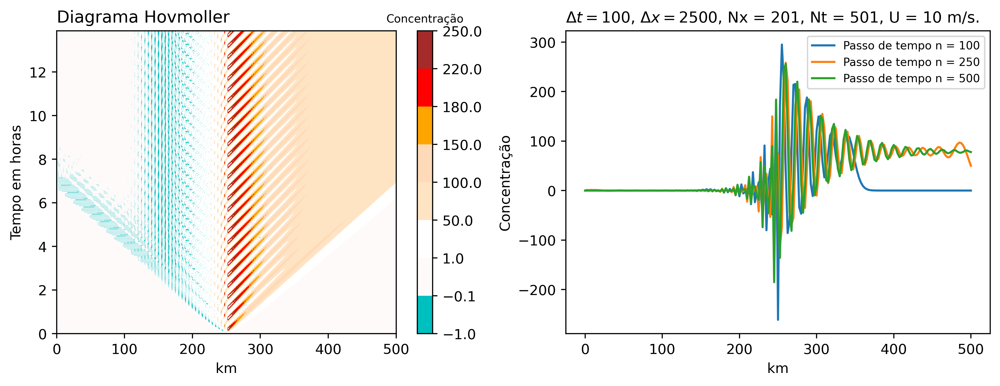
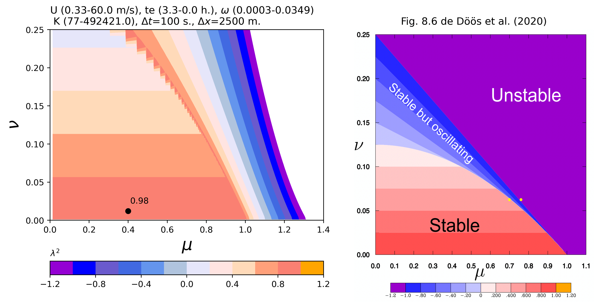

# 1. Introdução
Os modelos de transporte atmosférico resolvem os processos físicos (advecção, difusão, nuvens, sedimentação seca) e químicos (reações de gas para aerossóis, emissões e sumidouros) ao longo do tempo como mostra a @eq:quim, onde $c_i$ é a concentração da espécie e $R_{gi}$ e $E_i$ são a produção neta da reação da fase gasosa e a emissão, respetivamente [@Seinfeld2016]. Na realidade, estes processos acontecem simultaneamente. No entanto, tentar resolver todo com uma só equação discretizada numericamente pode gerar muita demanda de recursos computacionais e cada processo pode precisar de um esquema numérico diferente para obter uma solução numérica. Então temos um problema de acoplamento que precisa de alguma técnica para obter a solução da @eq:quim. Para isso, a técnica de *splitting* ou também chamado *timestep splitting* permite resolver individualmente os processos para ser adicionados e obter o resultados final de todos os processos. Esta técnica é a mais usada na maioria de modelos atmosféricos de transporte químico [@Seinfeld2016]. 

$$
\frac{\partial c_i}{\partial t}= \left(\frac{\partial c_i}{\partial t} \right)_{adv} + \left(\frac{\partial c_i}{\partial t} \right)_{diff} + \left(\frac{\partial c_i}{\partial t} \right)_{nuv} + \left(\frac{\partial c_i}{\partial t} \right)_{gas} + \left(\frac{\partial c_i}{\partial t} \right)_{aer} + R_{gi} + E_i
$${#eq:quim}

Conforme com @Seinfeld2016, a concentração muda cada $\Delta t$ como segue $\Delta c = c(t + \Delta t) - c(t)$. Se nós desacoplamos cada processo temos $\Delta c^A = A(\Delta t)c(t)$, $\Delta c^D = D(\Delta t)c(t)$, $\Delta c^{Nuv} = Nuv(\Delta t)c(t)$, $\Delta c^G = G(\Delta t)c(t)$, $\Delta c^{Aer} = Aer(\Delta t)c(t)$, $\Delta c^R = R(\Delta t)c(t)$, $\Delta c^E = E(\Delta t)c(t)$, que podem ser adicionados em paralelo $\Delta c = \Delta c^A + \Delta c^D + \Delta c^{Nuv} + \Delta c^G  + \Delta c^{Aer} + \Delta c^R + \Delta c^E$ para obter a nova concentração $c(t + \Delta t)= c(t) + \Delta c$, ou em série como mostra a [@eq:serie] [@Seinfeld2016]. Nem todos os processos podem variar a concentração no mesmo $\Delta t$ pelo que pode gerar erros na representação do processo.

$$\begin{aligned}
c^1(t+\Delta t) & = A(\Delta t)c(t)\\
c^2(t+\Delta t) & = D(\Delta t)c^1(t+\Delta t)\\
c^3(t+\Delta t) & = Nuv(\Delta t)c^2(t+\Delta t)\\
c^4(t+\Delta t) & = Aer(\Delta t)c^3(t+\Delta t)\\
c^5(t+\Delta t) & = R(\Delta t)c^4(t+\Delta t)\\
c(t+\Delta t) & = E(\Delta t)c^5(t+\Delta t)
\end{aligned}$${#eq:serie}

Neste trabalho aplicamos o operador *splitting* na solução numérica da advecção, adicionando a difusão, com a forçante $F$ que é uma fonte senoidal que varia no tempo ($n \Delta t$) nas mesmas condições do exercício 2. Conforme com @Doos2020, a difusão pode ser discretizada como o segundo ordem da derivada (@eq:dis), o qual melhora a estabilidade do esquema numérico leapfrog aplicado neste trabalho. Finalmente, os resultados foram verificados experimentalmente com o critério discutido na Fig. 8.6 de @Doos2020 para a estabilidade numérica do esquema, considerando variações do vento ($U$) e o termo da difusão ($K$ ou kappa) para $F$ = 0. Os resultados com e sem *splitting* também foram comparados e mostram diferenças pequenas na solução numérica quando varia o tempo (n+1) no caso da forçante.

$$
\left(\frac{d^2 u}{dx^2}\right)_j \approxeq \left[\frac{d}{dx}\left(\frac{d u}{dx}\right) \right]_j \approx \frac{\frac{u_{j+1} - u_j}{\Delta x} - \frac{u_j - u_{j-1}}{\Delta x}}{\Delta x} = \frac{u_{j+1}-2u_j+u_{j-1}}{(\Delta x)^2}
$${#eq:dis}

# 2. Descrição da metodologia
A aproximação considerou as condições do exercício 2 com a adição do efeito da difusão; a equação que governa este problema é dada por:

$$\frac{\partial C}{\partial t} + U \frac{\partial C}{\partial x} = K \frac{\partial^2C}{\partial^2 x} + F$${#eq:ex3}

Onde $F$ é a mesma fonte periódica do Ex. 2, localizado na metade da grade com uma resolução horizontal $\Delta x = 2500$ metros e temporal $\Delta t = 50$ segundos. O requerimento do exercício 3 é determinar o fator $K$ de forma que o tempo de decaimento seja da ordem de 3 horas. Inicialmente $F$ está no tempo n, como segue
$$\frac{\partial C}{\partial t} \rightarrow \frac{(C^{n+1} - C^{n-1})}{2 \Delta t}$$ e radiacional nas condições de fronteira. A @eq:ex3 foi discretizada para o esquema leapfrog (@eq:leap), considerando a advecção e a difusão no tempo n-1 com a forçante no tempo n-1. Depois a forçante é introduzido com o método *splitting*.

$$ C^{n+1}_j =  C^{n-1}_j - 2\Delta t \, U\frac{C^n_{j+1} - C^n_{j-1}}{2\Delta x} + 2\Delta t\,K\frac{C^{n-1}_{j+1}-2C^{n-1}_j+C^{n-1}_{j-1}}{(\Delta x)^2}+ 2\Delta t F^{n-1}_j$${#eq:leap}
ou também expressado como,
$$ C^{n+1}_j =  C^{n-1}_j - \mu(C^n_{j+1} - C^n_{j-1}) + 2\nu (C^{n-1}_{j+1}-2C^{n-1}_j+C^{n-1}_{j-1})+ 2\Delta t F^{n-1}_j,$$
onde $\mu = \frac{U\,\Delta t}{\Delta x}$ como número de Courant e $\nu \approxeq K\,\Delta t/(\Delta x)^2$ número de difusão. A equação de difusão linear de segunda ordem tem um tempo de decaimento expressado como $te = \frac{1}{K\,k^2}$, onde $k$ é o número de onda ($k = \frac{\omega}{U}$).

A verificação do critério de estabilidade discutido em @Doos2020 considera avaliar $\lambda ^2$ em função de $\nu$ e $\mu$ com $F = 0$, ou seja a equação é de advecção e difusão. O analise de estabilidade com o esquema leapfrog é expressado com a equação 
$$\lambda ^2 + 2ia\lambda + 8b -1 = 0$${#eq:lambda}
, onde $a \approxeq \mu \sin (k\Delta x)$ e $b \approxeq \nu \sin ^2(\frac{k\Delta x}{2})$. As duas soluções da equação são $\lambda = -ia \pm \sqrt{-a^2 +1 -8b}$. Se $1 - 8b -a^2 > 0$, logo $|\lambda|^2 = a^2 + 1 - 8b -a^2 = 1-8b<1$ apresenta um esquema estável. Porém, se $1 - 8b -a^2 < 0$, logo $\lambda = -i(a \mp \sqrt{a^2+8b-1})$, temos $\lambda ^2 = -(2a^2+8b-1 \mp 2a\sqrt{a^2+8b-1})$; as duas ultimas soluções foram consideradas para achar a relação com $\nu$ e $\mu$.

# 3. Resultados
A @Fig:1 mostra a solução numérica com o esquema leapfrog sem *splitting* chamado "Base". Os resultados mostram diferenças entre as duas soluções, principalmente o quando a fonte é acoplada em tempos diferentes, quase em paralelo. A verificação experimental com $F$=0 da estabilidade considera a comparação de $\lambda ^2$ para as condições do exercício (U=10 m/s, $\omega = 2\pi/1800$ e te = 3 h) e baseado nas duas soluções da @eq:lambda:
$$
\begin{aligned}
|\lambda|^2 &= 1-8b<1\\
\lambda ^2 &= -(2a^2+8b-1 + 2a\sqrt{a^2+8b-1})
\end{aligned}
$$
Além disso, com variações de U e K (kappa) e adicionais com omega e o tempo de decaimento mostram resultados na @Fig:2, comparado com a Fig. 8.6 de @Doos2020.

{#fig:1}

{#fig:2}

# 4. Discussão dos resultados
xxx

# Bibliografia
<div id="refs"></div>

# Apêndice A
O código escrito em Python começou com resolver todo sem o operador *splitting* como segue
```python
# Condições do exercício
# ----------------------
Nx, dx, Nt, dt, U  = 201, 2500, 501, 100, 10, 
x, _ = np.linspace(0, (Nx-1)*dx, Nx, retstep = True)
t, _ = np.linspace(0, (Nt-1)*dt, Nt, retstep = True)
CFL     = U*dt/dx
C = np.zeros((Nx, Nt))
F = C.copy()
w = int(dx/(dt*U)) # w*dt*U/dx = 1; w*dt = dx
T, X = np.meshgrid(t, x)
om = 2*np.pi/1800
te = 3*3600 # seconds decaimento
K = 1/(te*(om/U)**2) # kappa
v = K*dt/(dx)**2  # nu

# Método leapfrog
for n in range(1, Nt-1):
    # Euler forward
    if n == 1:
        # Inicialmente F no tempo n, Euler forward-backward
        F[101, n] = 1/2*(wave(t, n) + wave(t, n-1))
        for j in range(1, Nx-1): 
            C[j,n+1] = C[j,n] - CFL*(C[j,n]-C[j-1,n]) + 
                       v*(C[j+1,n]-2*C[j,n]+C[j-1,n]) +
                       dt*(F[j,n])
    else: # Fonte e difusão como n-1
        F[101, n-1] = 1/2*(wave(t, n-1) + wave(t, n-2))
        for j in range(1, Nx-1):
            C[j,n+1] = C[j,n-1] - CFL*(C[j+1,n]-C[j-1,n]) + 
                        2*v*(C[j+1,n-1]-2*C[j,n-1]+C[j-1,n-1]) + 2*dt*(F[j,n-1])
    
    # Radiacional
    C[-1, n+1] = C[-1, n] - CFL*(C[-1, n]- C[-2, n]) 
```

O segundo passo foi calcular com o operador *splitting* como segue:

```python
C = np.zeros((Nx, Nt))
Cs = C.copy()
F = C.copy()
for n in range(1, Nt-1):
    # Euler forward
    if n == 1:
        # Inicialmente F no tempo n, Euler forward-backward
        F[101, n] = 1/2*(wave(t, n) + wave(t, n-1))
        for j in range(1, Nx-1):
            # Passo 1
            # -------
            Cs[j,n+1] = C[j,n] - CFL*(C[j,n]-C[j-1,n]) + 
                        v*(Cs[j+1,n]-2*Cs[j,n]+Cs[j-1,n])
            # Passo 2
            # -------
            C[j,n+1] = Cs[j,n+1] + dt*(F[j,n])
            
    else: # Fonte e difusão como n-1
        F[101, n-1] = 1/2*(wave(t, n-1) + wave(t, n-2))
        for j in range(1, Nx-1):
            # Passo 1
            # -------
            Cs[j,n+1] = C[j,n-1] - CFL*(C[j+1,n]-C[j-1,n]) + 
                        2*v*(Cs[j+1,n-1]-2*Cs[j,n-1]+Cs[j-1,n-1])
            # Passo 2
            # -------
            C[j,n+1] = Cs[j,n+1] + 2*dt*F[j,n-1]
    
    # Radiacional
    C[-1, n+1] = C[-1, n] - CFL*(C[-1, n]- C[-2, n])
```
Para o analises de estabilidade considerando o critério na Fig. 8.6 em @Doos2020, primeiro considerou-se variar a velocidade do vento, omega e o tempo de decaimento, como segue

```python
# Resultado do Exercício 3:
mu = U*dt/dx
k = om/U # numero de onda
K = 1/(te*k**2) # kappa
v = K*dt/(dx)**2  # nu
a = mu * np.sin(k*dx)
b = v * np.sin(k*dx/2)**2
lb = lambda a, b: 1 - 8*b if 1 - 8*b - a**2 > 0 else 
                  -(2*a** + 8*b - 1 + 2*a*np.sqrt(a**2+8*b-1))
lb_ex3 = lb(a, b)

# Avaliação com o critério de estabilidade para gerar a figura
# ------------------------------------------------------------
# Variação da U, mantendo 
Us = np.linspace(U/30, U*6, 1000)
oms = np.linspace(om/10, om*10, 1000)
mus = Us*dt/dx # CFLs
ks = oms/Us # números de onda

# Variação do K (kappa) podendo varia te
tes = np.linspace(te/1800, te*1.1, 1000)
Ks = 1/(tes*ks**2) # kappas
vs = Ks*dt/(dx)**2  # nu

MUS, VS = np.meshgrid(mus, vs)
lamb = np.zeros(MUS.shape)*np.nan

for i in range(len(vs)):
    for j in range(len(mus)):
        a = mus[j] * np.sin(ks[j]*dx)      
        b = vs[i] * (np.sin(ks[i]*dx/2))**2
        key = 1 - 8*b - a**2
        if key > 0:
            lamb[i,j] = 1 - 8*b
        elif key < 0:
            lamb[i,j] = -(2*a** + 8*b - 1 + 2*a*np.sqrt(a**2+8*b-1))

fig, (ax, ax2) = plt.subplots(1,2, figsize=(12,6), gridspec_kw={'wspace':.05})
im = ax.contourf(MUS, VS, lamb, levels= np.arange(-1.2,1.4,.2), colors=colores) 
cbar = fig.colorbar(im, ax=ax,orientation="horizontal")
cbar.ax.set_title('$\lambda ^2$', fontsize=10, loc='left')
ax.set_xlabel("$\mu$", fontsize=20, fontweight='bold')
ax.set_ylabel("$\\nu$", fontsize=20, fontweight='bold')
ax.set_xlim(0, 1.1)
ax.set_ylim(0, 0.25)
ax.scatter(mu, v, c="k")
ax.text(mu+.01, v+.01, str(round(lb_ex3,2)))
ax.set_title(f"U ({round(Us[0],2)}-{round(Us[-1],2)} m/s), \
              te ({round(tes[0]/3600,2)}-{round(tes[-1]/3600,2)} h.), \
              $\omega$ ({round(oms[0],4)}-{round(oms[-1],4)})\
              \n K ({round(Ks[0])}-{round(Ks[-1],0)}), \
              $\Delta t$={dt} s., $\Delta x$={dx} m.", loc='left')
im2 = plt.imread('fig/fig8_6_doos.png')
ax2.imshow(im2, extent=(-0.1, 1, 0.2, 1.45))
ax2.set_title("Fig. 8.6 de Döös et al. (2020)")
ax2.axis('off')
fig.savefig("fig/estabilidade.png", dpi = 400, bbox_inches='tight', facecolor='w')
```

