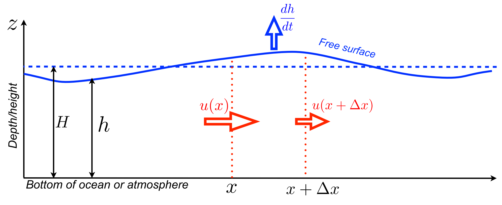
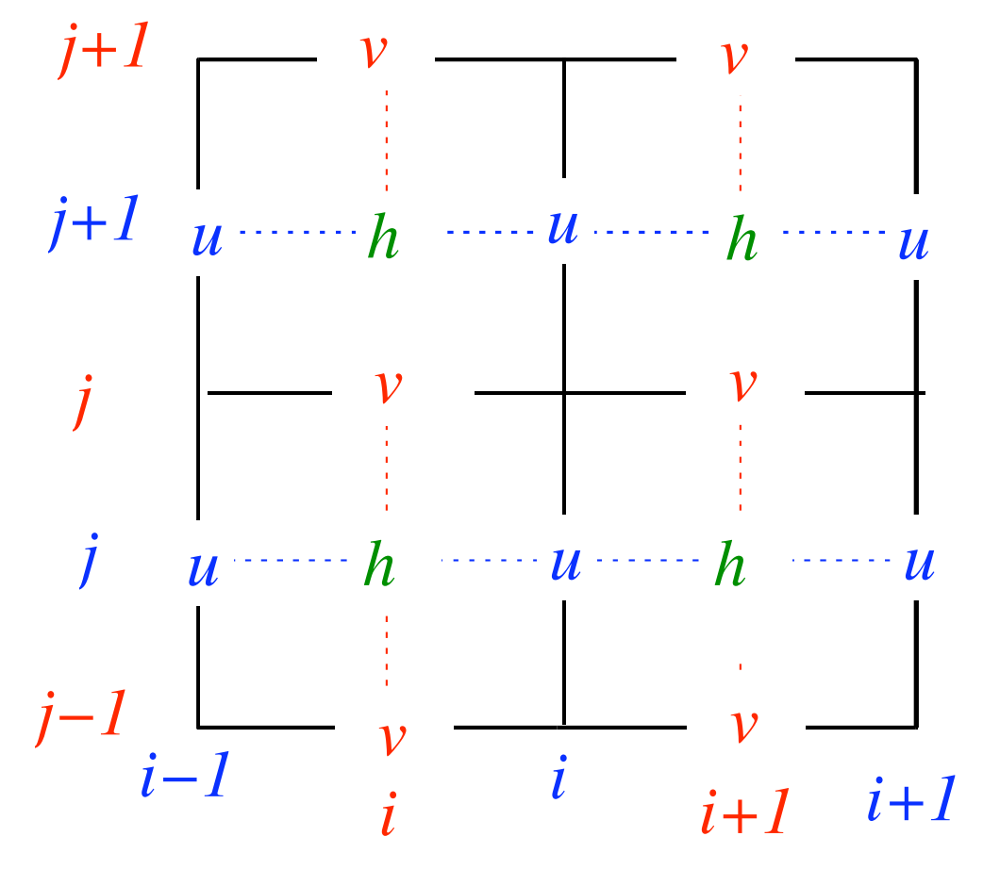
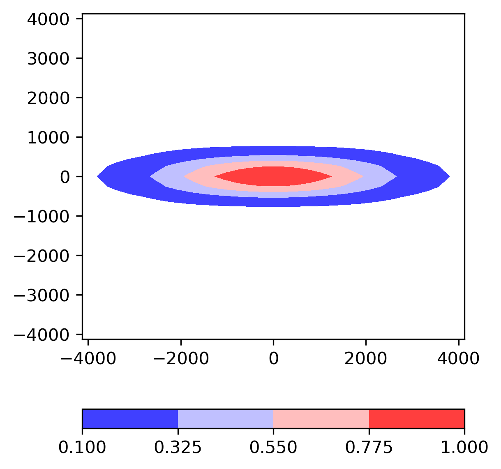
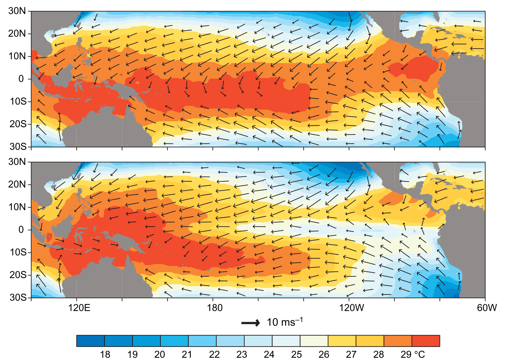
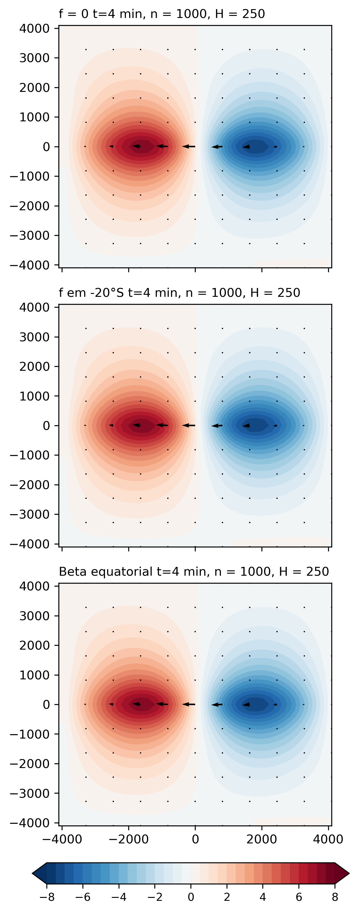
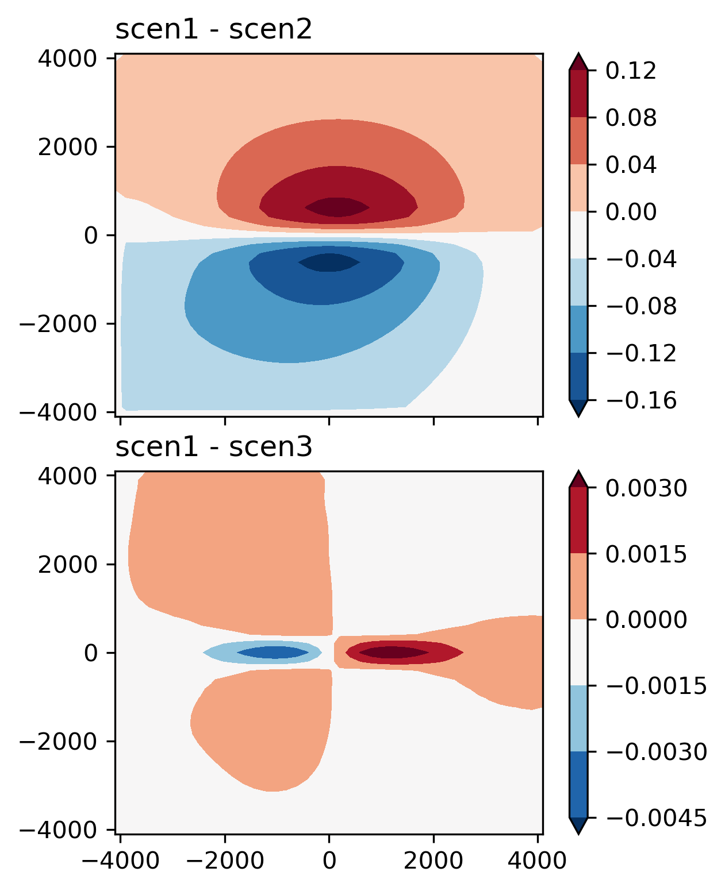
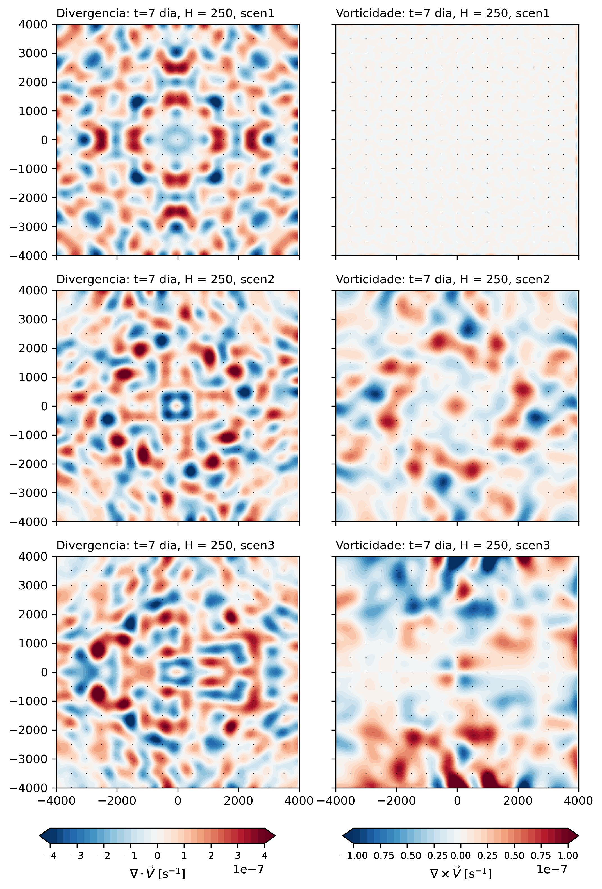

# 1. Introdução
O modelo de água rasa considera equações para representar o ajuste geostrófico para o deslocamento das ondas de gravidade e inerciais considerando as propriedades conservativas de momentum e massa [@Randall2021]. O modelo é importante para representar fenômenos atmosféricos ou oceanográficos. Nos estudos de qualidade do ar pode representar a variação da camada de mistura ao longo do dia que impacta na concentração dos poluentes. O modelo também tem aplicações oceanográficas onde a força zonal dos ventos pode afetar o deslocamento das correntes como propagação de ondas com variação da altura do fluído, como é ilustrado na @Fig:1. Conforme com @Doos2020, as ondas de gravidade no modelo 1D pode-se propagar ao longo do eixo x em ambas direções com uma velocidade $c=\sqrt{gH}$ sem depender do número de onda pelo que é considerado não dispersivo; onde $g$ é a aceleração da gravidade e $H$ a altura média do fluído.

{#fig:1}

O modelo de água rasa 2D (e.g., nos eixos "x" e "y") presenta equações de variação zonal (@eq:1), meridional (@eq:2) e de altura (@eq:3). As equações tem como parâmetros o vento zonal ($u$), meridional ($v$), altura geopotencial ($\phi$) e a aceleração de Coriolis $f \equiv 2\Omega \,\sin \varphi$, onde $\Omega$ é a frequência angular da rotação da Terra e $\varphi$ a latitude. As equações estão balanceadas com as fontes de momentum zonal ($F_u$), meridional ($F_v$) e de massa ($F_{\phi}$).

$$\frac{\partial u}{\partial t}+u\frac{\partial u}{\partial x} + v\frac{\partial u}{\partial y} - fv + \frac{\partial \phi}{\partial x} = F_u$${#eq:1}
$$\frac{\partial v}{\partial t}+u\frac{\partial v}{\partial x} + v\frac{\partial v}{\partial y} - fu + \frac{\partial \phi}{\partial y} = F_v$${#eq:2}
$$\frac{\partial \phi}{\partial t}+u\frac{\partial \phi}{\partial x} + v\frac{\partial \phi}{\partial y} +\phi.\nabla(V) = F_{\phi}$${#eq:3}

Se as equações mostradas acima têm um campo básico nulo do vector horizontal $\vec{V}$, podemos obter as seguintes equações linearizadas balanceadas com as fontes de momentum:

$$\frac{\partial u}{\partial t} - fv + g\frac{\partial h}{\partial x} = F_u,$${#eq:4}
$$\frac{\partial v}{\partial t} - fu + g\frac{\partial h}{\partial y} = F_v,$${#eq:5}
$$\frac{\partial h}{\partial t} +H \left(\frac{\partial u}{\partial x}+\frac{\partial v}{\partial y}\right) = F_{\phi}.$${#eq:6}

As equações linearizadas podem ser discretizadas para diferentes tipos de grades chamadas de tipo Arakawa [@mesinger1976]. A grade mais usada pelos modelos atmosféricos como o caso do modelo WRF-Chem é do tipo C, ilustrado na @Fig:2. Se usamos o programa Python, podemos gerar tres tipos de matrices. Se usamos o esquema leap-frog para discretizar as equações linearizadas podemos ter as seguintes equações:

$$\footnotesize
\begin{aligned}
\frac{u^{n+1}_{i,j}-u^{n-1}_{i,j}}{2\Delta t}=-g\frac{h^n_{i+1,j}-h^n_{i,j}}{\Delta x}+ \\ \frac{f}{4}(v^n_{i,j}+v^n_{i+1,j}+v^n_{i+1,j-1}+v^n_{i,j-1}),
\end{aligned}$${#eq:7}

$$\footnotesize
\begin{aligned}
\frac{v^{n+1}_{i,j}-v^{n-1}_{i,j}}{2\Delta t}=-g\frac{h^n_{i,j+1}-h^n_{i,j}}{\Delta y}- \\ \frac{f}{4}(u^n_{i,j}+u^n_{i,j+1}+u^n_{i-1,j+1}+u^n_{i-1,j}),\end{aligned}$${#eq:8}

$$\scriptsize
\begin{aligned}
\frac{h^{n+1}_{i,j}-h^{n-1}_{i,j}}{2\Delta t}=-H\left(\frac{u^n_{i,j}-u^n_{i-1,j}}{\Delta x}+\frac{v^n_{i,j}- v^n_{i,j-1}}{\Delta y}\right).\end{aligned}$${#eq:9}

Conforme com @Doos2020, a analise de estabilidade, assumindo que $\Delta x = \Delta y$, satisfaz o critério para todas as longitudes de onda quando 

$$\mu \equiv \frac{\sqrt{gH}\Delta t}{\Delta x} \leq 0.35$$

Para as condições de fronteira no caso da grade C tipo Arakawa os componentes zonal e meridional são considerados para representar a propagação radiacional devido que os parâmetros $u$ e $v$ têm pontos adicionais que $h$. Na fronteira oeste, norte e sul podemos representar-los como $\partial u_0/\partial t - c~\partial u_0/\partial x = 0$, $\partial v_j/\partial t + c~\partial v_j/\partial y = 0$ e $\partial v_0/\partial t - c~\partial v_0/\partial y = 0$, respetivamente.

{#fig:2}

Finalmente, a formulação do modelo preserva as propriedades conservativas e asseguram a estabilidade computacional do modelo. A conservação da massa ajuda em manter a pressão superficial dentro dos valores esperados realistas [@Doos2020].

# 2. Descrição da metodologia
O exercício considera três condições com variação do parâmetro Coriolis (f=0, f=$f_0$ na latitude 20°S e f=$\beta$y para o plano beta equatorial). A opção de fonte escolhida é de tipo oceanográfico de momentum zonal constante com ventos de leste, com gaussiana centrada no equador e alongada na direção zonal (@Fig:3). Ela representa o processo de formação do El Niño-Southern Oscillation (ENSO), pelo que a fonte de momentum é negativa para representar ventos do leste, no jeito similar com o ilustrado na @Fig:4.
As condições de fronteira escolhidas são radiacional no oeste, norte e sul, e uma condição de fronteira rígida na fronteira leste. As variáveis escolhidas de $H$ foram três: 1 m, 250 m e 50 m. A resolução espacial horizontal é de $\Delta x = \Delta y = 100$ km. Depois da integração numérica com o esquema leap-frog foi verificado a conservação de massa e de energia. Finalmente, foram gerados mapas de divergência e vorticidade.

{#fig:3}

{#fig:4}

Em geral, conforme com as sugestões de @Doos2020, primeiro as condições iniciais foram estabelecidas para $n=0$ para todos os indices $i$ e $j$ numa grade tipo C: $u^{n=0}_{i+1,j}$ = 0, $v^{n=0}_{i,j+1}$ = 0, $h^{n=0}_{i,j}$ = 0. Depois, a integração das equações do modelo de água rasa considerou o esquema *Euler-forward* para o primeiro passo de tempo ($n=1$). Os seguintes passos de tempo seguiram com uma integração das equações com o esquema leap-frog. A programação da discretização das equações foi escrita em código de Python, disponível no GitHub "Modelagem", Exercício 4, [functions.py](https://github.com/adelgadop/Modelagem/blob/main/Exercicio_4/functions.py).

# 3. Resultados
Os resultados de variação de 'h' e os ventos para o caso da fonte de momentum zonal constante (vento forçante de leste, como mostra a @Fig:3) são mostrados na @Fig:5 para diferentes valores de Coriolis (f = 0, f constante para a latitude 20°S e variação de f no plano beta equatorial). Podemos notar diferenças pequenas entre elas como mostra a @Fig:6. Os mapas de divergência e vorticidade são apresentados na @Fig:7. 

{#fig:5}

{#fig:6}

{#fig:7}

# 4. Discussão dos resultados

# Bibliografia

