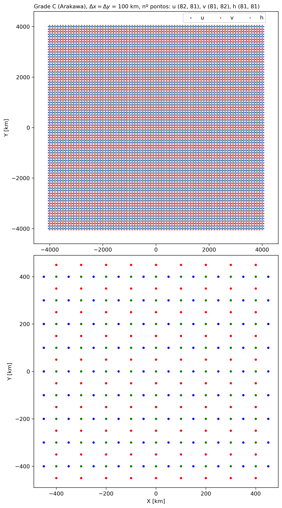

**Palavras-chave**: Modelo de água rasa, 2D, fonte zonal constante.

***

# 1. Introdução
O modelo de água rasa considera equações para representar o ajuste geostrófico para o deslocamento das ondas de gravidade e inerciais considerando as propriedades conservativas de momentum e massa [@Randall2021]. O modelo é importante para representar fenômenos atmosféricos ou oceanográficos. Nos estudos de qualidade do ar pode representar a variação da camada de mistura ao longo do dia que impacta na concentração dos poluentes. O modelo também tem aplicações oceanográficas onde a fonte do vento zonal pode afetar o deslocamento das correntes como propagação de ondas com variação na altura do fluído, como é ilustrado na @Fig:1. Conforme com @Doos2020, as ondas de gravidade no modelo 1D pode-se propagar ao longo do eixo x em ambas direções com uma velocidade $c=\sqrt{gH}$ sem depender do número de onda pelo que é considerado não dispersivo; onde $g$ é a aceleração da gravidade e $H$ a altura média do fluído.

{#fig:1}

## 1.1 Modelo de água rasa 2D linearizado
O modelo de água rasa 2D (e.g., nos eixos "x" e "y") presenta equações de variação zonal (@eq:1), meridional (@eq:2) e de altura (@eq:3). As equações tem como parâmetros o vento zonal ($u$), meridional ($v$), altura geopotencial ($\phi$) e a aceleração de Coriolis $f \equiv 2\Omega \,\sin \varphi$, onde $\Omega$ é a frequência angular da rotação da Terra ($\Omega=  \frac{2\pi}{86400}$ s$^{-1}$) e $\varphi$ a latitude. As equações estão balanceadas com as fontes de momentum zonal ($F_u$), meridional ($F_v$) e de massa ($F_{\phi}$).

$$\frac{\partial u}{\partial t}+u\frac{\partial u}{\partial x} + v\frac{\partial u}{\partial y} - fv + \frac{\partial \phi}{\partial x} = F_u$${#eq:1}
$$\frac{\partial v}{\partial t}+u\frac{\partial v}{\partial x} + v\frac{\partial v}{\partial y} - fu + \frac{\partial \phi}{\partial y} = F_v$${#eq:2}
$$\frac{\partial \phi}{\partial t}+u\frac{\partial \phi}{\partial x} + v\frac{\partial \phi}{\partial y} +\phi.\nabla(V) = F_{\phi}$${#eq:3}

Se as equações mostradas acima têm um campo básico nulo do vector horizontal $\vec{V}$, podemos obter as seguintes equações linearizadas balanceadas com as fontes de momentum:

$$\frac{\partial u}{\partial t} - fv + g\frac{\partial h}{\partial x} = F_u,$${#eq:4}
$$\frac{\partial v}{\partial t} - fu + g\frac{\partial h}{\partial y} = F_v,$${#eq:5}
$$\frac{\partial h}{\partial t} +H \left(\frac{\partial u}{\partial x}+\frac{\partial v}{\partial y}\right) = F_{\phi}.$${#eq:6}

{#fig:2}

As equações linearizadas podem ser discretizadas para diferentes tipos de grades chamadas de tipo Arakawa [@mesinger1976]. A grade mais usada pelos modelos atmosféricos como o caso do modelo WRF-Chem é do tipo C, ilustrado na @Fig:2. O Coriolis (*f*) no plano beta equatorial está definido como $f=\beta y$, onde $\beta = \frac{2 \Omega}{a}$ ($a$ como rádio da terra equal a 6371000 m). Se usamos o esquema leap-frog para discretizar as equações linearizadas podemos ter as seguintes aproximações:

$$\footnotesize
\begin{aligned}
\frac{u^{n+1}_{i,j}-u^{n-1}_{i,j}}{2\Delta t}=-g\frac{h^n_{i+1,j}-h^n_{i,j}}{\Delta x}+ \\ \frac{f}{4}(v^n_{i,j}+v^n_{i+1,j}+v^n_{i+1,j-1}+v^n_{i,j-1}),
\end{aligned}$${#eq:7}

$$\footnotesize
\begin{aligned}
\frac{v^{n+1}_{i,j}-v^{n-1}_{i,j}}{2\Delta t}=-g\frac{h^n_{i,j+1}-h^n_{i,j}}{\Delta y}- \\ \frac{f}{4}(u^n_{i,j}+u^n_{i,j+1}+u^n_{i-1,j+1}+u^n_{i-1,j}),\end{aligned}$${#eq:8}

$$\scriptsize
\begin{aligned}
\frac{h^{n+1}_{i,j}-h^{n-1}_{i,j}}{2\Delta t}=-H\left(\frac{u^n_{i,j}-u^n_{i-1,j}}{\Delta x}+\frac{v^n_{i,j}- v^n_{i,j-1}}{\Delta y}\right).\end{aligned}$${#eq:9}

Conforme com @Doos2020, a analise de estabilidade, assumindo que $\Delta x = \Delta y$, satisfaz o critério para todas as longitudes de onda quando 

$$\mu \equiv \frac{\sqrt{gH}\Delta t}{\Delta x} \leq 0.35$$

## 1.2 Condições de fronteira para o modelo linear 2D
Para as condições de fronteira no caso da grade C tipo Arakawa com Nx $\times$ Ny pontos para $h$, os componentes zonal ($u$) e meridional ($v$) são usados para representar a propagação radiacional devido que eles têm pontos adicionais nas direções Oeste-Leste (Nx+1) e Sul-Norte (Ny+1), respetivamente em comparação que $h$. Se consideramos *f*=0, a condição radiacional na fronteira oeste é definida como $\partial u_0/\partial t - c~\partial u_0/\partial x = 0$ e discretizada como $$u^{n+1}_{0, j} = u^{n}_{0, j} + c\frac{\Delta t}{\Delta x}(u^n_{1, j}-u^n_{0, j}).$$
Na fronteira leste temos uma condição rígida constante conforme às condições estabelecidas pelo exercício 4, discretizado como $u^{n+1}_{Nx+1, j} = 0$. Na fronteira sul a condição radiacional é definida como $\partial v_0/\partial t - c~\partial v_0/\partial y = 0$, discretizado como $$v^{n+1}_{i, 0} = v^{n}_{i, 0} + c\frac{\Delta t}{\Delta y}(v^n_{i, 1} - v^n_{i, 0}).$$ Na fronteira norte a radiacional é $\partial v_{Ny+1}/\partial t + c~\partial v_{Ny+1}/\partial y = 0$ que pode ser discretizado como $$v^{n+1}_{i, Ny+1} = v^{n}_{i, Ny+1} - c\frac{\Delta t}{\Delta y}(v^n_{i, Ny+1} - v^n_{i, Ny}).$$

## 1.3 Divergência e vorticidade
As [@eq:div; @eq:vor] estão relacionadas com a equação de água rasa não linearizada. Neste exercício 4, os termos de divergência [@eq:div] e vorticidade [@eq:vor] foram considerados para gerar os mapas respetivos para o caso da integração da fonte constante de vento zonal oceânico.

$$\nabla \cdot \vec{V} = \frac{\partial u}{\partial x} + \frac{\partial v}{\partial y,} $${#eq:div}

$$\nabla \times \vec{V} = \frac{\partial v}{\partial x} - \frac{\partial u}{\partial y.} $${#eq:vor}

A vorticidade absoluta, conforme com @Doos2020, está definida como $$\xi \equiv (f+ \frac{\partial v}{\partial x} - \frac{\partial u}{\partial y})\frac{1}{h}.$$ 

## 1.4 Verificação da conservação da massa e energia
Finalmente, a formulação do modelo preserva as propriedades conservativas e asseguram a estabilidade computacional do modelo. A conservação da massa ajuda em manter a pressão superficial dentro dos valores esperados realistas [@Doos2020], definida como $$M = \sum_{i=1}^{Nx} \sum_{j=1}^{Ny} h_{i,j}\Delta x \Delta y.$$ A conservação de energia (potencial e cinética) são definidas como segue, $$E_P = \frac{g}{2}\sum_{i=1}^{Nx} \sum_{j=1}^{Ny}(h_{i,j})^2\Delta x \Delta y,$$ $$E_K = \frac{H}{2}\sum_{i=1}^{Nx} \sum_{j=1}^{Ny}[(u^n_{i,j})^2 + (v^n_{i,j})^2]\Delta x \Delta y.$$

{#fig:3}

# 2. Descrição da metodologia
O exercício considera três condições com variação do parâmetro Coriolis (f=0, f=$f_0$ na latitude 20°S e f=$\beta$y para o plano beta equatorial). A opção de fonte escolhida é de tipo oceanográfico de momentum zonal constante com ventos de leste, com gaussiana centrada no equador e alongada na direção zonal (@Fig:3), definida pela @eq:Fonte.  

$$ Fu = -\frac{exp(\frac{-Xu^2}{(Nrx.\Delta x)^2}-\frac{Yu^2}{(Nry.\Delta y)^2})}{24*3600} $${#eq:Fonte}

Onde $Xu$ e $Yu$ são os pontos na direção x e y da componente zonal ($u$), $Nrx$ e $Nry$ são pontos na direção x e y para definir o alongamento da fonte zonal $Fu$.  Ela representa escoamentos dos ventos do leste no domínio em direção oeste. No processo de formação do El Niño-Southern Oscillation (ENSO) quando os ventos são do leste, temos um fenômeno conhecido como "La Niña" (período frio), como é ilustrado na @Fig:enso. 

O desenho da grade C no programa Python gerou três tipos de matrizes. O primeiro com o domínio de $h$ de 81 $\times$ 81 pontos com variação espacial desde -4000 km até 4000 km. As duas seguintes apresentam matrizes para os componentes zonal e meridional com pontos adicionais nos eixos X e Y. No [Apêndice A](#apêndice-a), mostramos a configuração do domínio como grade tipo C como base para calcular as aproximações das perturbações da fonte constante zonal do leste. As condições de fronteira escolhidas são radiacional no oeste, norte e sul, e uma condição rígida na fronteira leste. As variáveis escolhidas de $H$ foram de 1 m; os primeiros testes foram conduzidos para um $H=250$ m. A resolução espacial horizontal é de $\Delta x = \Delta y = 100$ km, com integração numérica para 240 dias com um $\Delta t = 3600$ segundos. O esquema usado é o leap-frog com resultados salvados para cada passo de tempo "n". Também foram calculados o volumem e energia total para cada passo de tempo. Finalmente, foram gerados mapas de divergência e vorticidade para o dia 120 que corresponde à metade do período.

{#fig:enso}

Conforme com as sugestões de @Doos2020, primeiro as condições iniciais foram estabelecidas para $n=0$ para todos os indices $i$ e $j$ numa grade tipo C: $u^{n=0}_{i+1,j}$ = 0, $v^{n=0}_{i,j+1}$ = 0, $h^{n=0}_{i,j}$ = 0. Depois, a integração das equações do modelo de água rasa considerou o esquema *Euler-forward* para o primeiro passo de tempo ($n=1$). Os seguintes passos de tempo seguiram com uma integração das equações com o esquema leap-frog. A programação da discretização das equações foi escrita em código de Python, disponível no GitHub "Modelagem", Exercício 4, [functions.py](https://github.com/adelgadop/Modelagem/blob/main/Exercicio_4/functions.py).

# 3. Resultados
Os resultados de variação de 'h' e os ventos para o caso da fonte de momentum zonal constante (vento forçante de leste, como mostra a @Fig:3) são mostrados na @Fig:5 para diferentes valores de Coriolis (f = 0, f constante para a latitude 20°S e variação de f no plano beta equatorial). Os mapas de divergência e vorticidade são apresentados na @Fig:6. 

A @Fig:cons mostra o volume e energia total dos resultados de simulação para cada cenário.

{#fig:5}

{#fig:6}

{#fig:cons}

# 4. Discussão dos resultados

# Bibliografia

\appendix
# Apêndice A
A @Fig:gradeC mostra o domínio usado para simular os três experimentos. 

{#fig:gradeC}