> **Palavras-chave**: Modelo de água rasa, 2D, fonte zonal constante.

***

# 1. Introdução
O modelo de água rasa considera equações para representar o ajuste geostrófico para o deslocamento das ondas de gravidade e inerciais considerando as propriedades conservativas de momentum e massa [@Randall2021]. 
O modelo é importante para representar fenômenos atmosféricos ou oceanográficos. 
Nos estudos de qualidade do ar pode representar a variação da camada de mistura ao longo do dia que impacta na concentração dos poluentes. O modelo também tem aplicações oceanográficas onde a fonte do vento zonal pode afetar o deslocamento das correntes como propagação de ondas com variação na altura do fluído, como é ilustrado na @Fig:1. 
Conforme com @Doos2020, as ondas de gravidade no modelo 1D pode-se propagar ao longo do eixo x em ambas direções com uma velocidade $c=\sqrt{gH}$ sem depender do número de onda pelo que é considerado não dispersivo; onde $g$ é a aceleração da gravidade e $H$ a altura média do fluído.

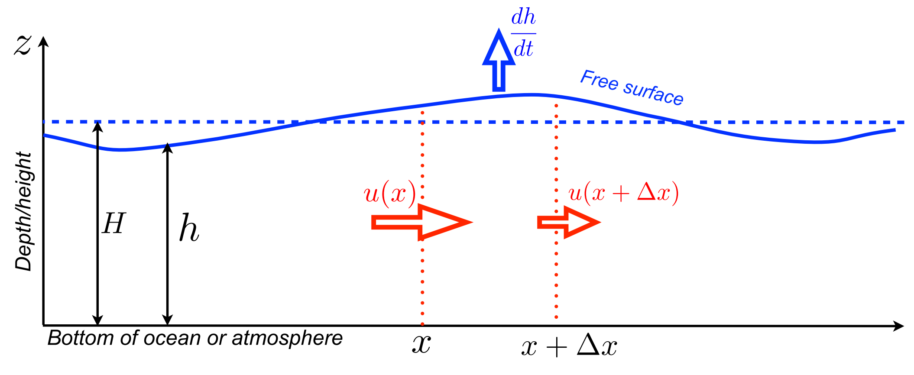{#fig:1}

## 1.1 Modelo de água rasa 2D 
O modelo de água rasa 2D (e.g., nos eixos "x" e "y") presenta equações de variação zonal (@eq:1), meridional (@eq:2) e de altura (@eq:3). As equações tem como parâmetros o vento zonal ($u$), meridional ($v$), altura geopotencial ($\phi$) e a aceleração de Coriolis $f \equiv 2\Omega \,\sin \varphi$, onde $\Omega$ é a frequência angular da rotação da Terra ($\Omega=  \frac{2\pi}{86400}$ s$^{-1}$) e $\varphi$ a latitude. 
As equações estão balanceadas com as fontes de momentum zonal ($F_u$), meridional ($F_v$) e de massa ($F_{\phi}$).

$$\frac{\partial u}{\partial t}+u\frac{\partial u}{\partial x} + v\frac{\partial u}{\partial y} - fv + \frac{\partial \phi}{\partial x} = F_u$${#eq:1}
$$\frac{\partial v}{\partial t}+u\frac{\partial v}{\partial x} + v\frac{\partial v}{\partial y} - fu + \frac{\partial \phi}{\partial y} = F_v$${#eq:2}
$$\frac{\partial \phi}{\partial t}+u\frac{\partial \phi}{\partial x} + v\frac{\partial \phi}{\partial y} +\phi.\nabla(V) = F_{\phi}$${#eq:3}

Se as equações mostradas acima têm um campo básico nulo do vector horizontal $\vec{V}$, podemos obter as seguintes equações linearizadas balanceadas com as fontes de momentum:

$$\frac{\partial u}{\partial t} - fv + g\frac{\partial h}{\partial x} = F_u,$${#eq:4}
$$\frac{\partial v}{\partial t} - fu + g\frac{\partial h}{\partial y} = F_v,$${#eq:5}
$$\frac{\partial h}{\partial t} +H \left(\frac{\partial u}{\partial x}+\frac{\partial v}{\partial y}\right) = F_{\phi}.$${#eq:6}

Onde H é altura média da coluna de água ou de ár e $h$ a coluna de água que pode variar pela perturbação pela fonte zonal o de massa no domínio do modelo.
O Coriolis (*f*) no plano beta equatorial está definido como $f=\beta y$, onde $\beta = \frac{2 \Omega}{a}$ ($a$ como rádio da terra equal a 6371000 m).
As equações linearizadas podem ser discretizadas para diferentes tipos de grades chamadas de tipo Arakawa [@mesinger1976]. 
Esta é a grade mais usada pelos modelos atmosféricos como o caso do modelo WRF-Chem. 
Se usamos o esquema leap-frog para discretizar as equações linearizadas podemos ter as seguintes aproximações:

$$\footnotesize
\begin{aligned}
\frac{u^{n+1}_{i,j}-u^{n-1}_{i,j}}{2\Delta t}=-g\frac{h^n_{i+1,j}-h^n_{i,j}}{\Delta x}+ \\ \frac{f}{4}(v^n_{i,j}+v^n_{i+1,j}+v^n_{i+1,j-1}+v^n_{i,j-1}),
\end{aligned}$${#eq:7}

$$\footnotesize
\begin{aligned}
\frac{v^{n+1}_{i,j}-v^{n-1}_{i,j}}{2\Delta t}=-g\frac{h^n_{i,j+1}-h^n_{i,j}}{\Delta y}- \\ \frac{f}{4}(u^n_{i,j}+u^n_{i,j+1}+u^n_{i-1,j+1}+u^n_{i-1,j}),\end{aligned}$${#eq:8}

$$\scriptsize
\begin{aligned}
\frac{h^{n+1}_{i,j}-h^{n-1}_{i,j}}{2\Delta t}=-H\left(\frac{u^n_{i,j}-u^n_{i-1,j}}{\Delta x}+\frac{v^n_{i,j}- v^n_{i,j-1}}{\Delta y}\right).\end{aligned}$${#eq:9}

Conforme com @Doos2020, a analise de estabilidade, assumindo que $\Delta x = \Delta y$, satisfaz o critério para todas as longitudes de onda quando 

$$\mu \equiv \frac{\sqrt{gH}\Delta t}{\Delta x} \leq 0.35$$

As equações do modelo de água rasa não linearizada podem ser expressadas em termos da vorticidade potencial absoluta ($\xi \equiv (f + \partial v/\partial x - \partial u/\partial y)/h$) e $B$ é a função de Bernoulli ($B \equiv gh + 1/2(u^2+v^2)$), apresentados na forma escalar [@Doos2020],

\begin{align}
\frac{\partial \vec{u}}{\partial t} - \xi h v   = -\frac{\partial B}{\partial x}, \\
\frac{\partial \vec{v}}{\partial t} - \xi h u  = -\frac{\partial B}{\partial y}, \\
\frac{\partial h}{\partial t} + \frac{\partial (hu)}{\partial x} + \frac{\partial (hv) }{\partial y}  = 0,
\end{align}

Aqui $h$ é altura total de coluna de água ou de ár, alias não temos apenas um termo $H$.
O modelo durante a integração tem propriedades conservativas para massa, energia e enstrofia.
Esta última propriedade está relacionada com a vorticidade e na dissipação da energia.
A discretização das equações precisa das formulações detalhadas em @Doos2020 e resumida nas seguintes equações,

\begin{align}
\frac{\partial u}{\partial t} - \overline{\xi\overline{V}^x}^y + \frac{B_{i+1,j} - B_{i, j}}{\Delta x} = 0, \\
\frac{\partial v}{\partial t} + \overline{\xi\overline{U}^y}^x + \frac{B_{i,j+1} - B_{i, j}}{\Delta y} = 0, \\
\frac{\partial h}{\partial t} + \frac{U_{i,j}-U_{i-1,j}}{\Delta x} + \frac{V_{i,j} - V_{i,j-1}}{\Delta y} = 0.
\end{align}

Onde os fluxos $U_{i,j}$ e $V_{i,j}$ são definidos conforme as velocidades de u e v, como segue,

\begin{align}
U_{i,j} \equiv u_{i,j}\frac{1}{2}(h_{i,j} + h_{i+1, j}), \\
V_{i,j} \equiv v_{i,j}\frac{1}{2}(h_{i,j} + h_{i, j+1}).
\end{align}

Finalmente, nos pontos interiores dentro do domínio do modelo 2D podemos discretizar para resolver a propagação em termos de $\xi$, como segue

\begin{align}
\xi _{i,j} = \frac{f + (v_{i+1,j} - v_{i,j})/\Delta x - (u_{i,j+1} - u_{i,j})/\Delta y}{(h_{i,j}+h_{i+1,j}+h_{i,j+1}+h_{i+1, j+1})/4}.
\end{align}

## 1.2 Condições de fronteira
Para as condições de fronteira no caso da grade C tipo Arakawa com Nx $\times$ Ny pontos para $h$, os componentes zonal ($u$) e meridional ($v$) são usados para representar a propagação radiacional devido que eles têm pontos adicionais nas direções Oeste-Leste (Nx+1) e Sul-Norte (Ny+1), respetivamente em comparação que $h$. 
Se consideramos *f*=0, a condição radiacional na fronteira oeste é definida como $\partial u_0/\partial t - c~\partial u_0/\partial x = 0$ e discretizada como $$u^{n+1}_{0, j} = u^{n}_{0, j} + c\frac{\Delta t}{\Delta x}(u^n_{1, j}-u^n_{0, j}).$$
Na fronteira leste temos uma condição rígida constante conforme às condições estabelecidas pelo exercício 4, discretizado como $u^{n+1}_{Nx+1, j} = 0$. Na fronteira sul a condição radiacional é definida como $\partial v_0/\partial t - c~\partial v_0/\partial y = 0$, discretizado como $$v^{n+1}_{i, 0} = v^{n}_{i, 0} + c\frac{\Delta t}{\Delta y}(v^n_{i, 1} - v^n_{i, 0}).$$ Na fronteira norte a radiacional é $\partial v_{Ny+1}/\partial t + c~\partial v_{Ny+1}/\partial y = 0$ que pode ser discretizado como $$v^{n+1}_{i, Ny+1} = v^{n}_{i, Ny+1} - c\frac{\Delta t}{\Delta y}(v^n_{i, Ny+1} - v^n_{i, Ny}).$$

## 1.3 Divergência e vorticidade
As [@eq:div; @eq:vor] estão relacionadas com a equação de água rasa não linearizada. Neste exercício 4 e 5, os termos de divergência [@eq:div] e vorticidade [@eq:vor] foram considerados para gerar os mapas respetivos para o caso da integração da fonte constante de vento zonal oceânico.

$$\nabla \cdot \vec{V} = \frac{\partial u}{\partial x} + \frac{\partial v}{\partial y}, $${#eq:div}

$$\nabla \times \vec{V} = \frac{\partial v}{\partial x} - \frac{\partial u}{\partial y}. $${#eq:vor}

Uma divergência positiva mostra um campo vetorial espalhado em todas as direções a partir de um ponto de referência ou que o fluído vai para fora desse ponto.
Por outro lado, se a sinal é negativa, o campo está se concentrando na região como uma sucção do fluído num determinado ponto.
A vorticidade é uma medida da rotação ou de giro do fluido, sendo positiva quando é ciclônica e negativa se é anticiclônica. Temos dois tipos de vorticidade por curvatura e cisalhamento.
A vorticidade absoluta é a suma relativa da rotação das massas do ar mais a terrestre.

A relação da divergência e vorticidade estabelece que la variação da primeira de uma massa de ar é proporcionalmente à divergência com sinal trocado.
Nos níveis vertical e horizontal o comportamento da convergência horizontal (divergência negativa) acrescenta os fluxos verticais, em consequência a vorticidade é mais ciclônica (positiva). 

## 1.4 Verificação da conservação da massa e energia
Finalmente, a formulação do modelo preserva as propriedades conservativas e asseguram a estabilidade computacional do modelo. 
A conservação da massa ajuda em manter a pressão superficial dentro dos valores esperados realistas [@Doos2020], definida como $$M = \sum_{i=1}^{Nx} \sum_{j=1}^{Ny} h_{i,j}\Delta x \Delta y.$$ 
A conservação de energia (potencial e cinética) são definidas como segue, $$E_P = \frac{g}{2}\sum_{i=1}^{Nx} \sum_{j=1}^{Ny}(h_{i,j})^2\Delta x \Delta y,$$ $$E_K = \frac{H}{2}\sum_{i=1}^{Nx} \sum_{j=1}^{Ny}[(u^n_{i,j})^2 + (v^n_{i,j})^2]\Delta x \Delta y.$$

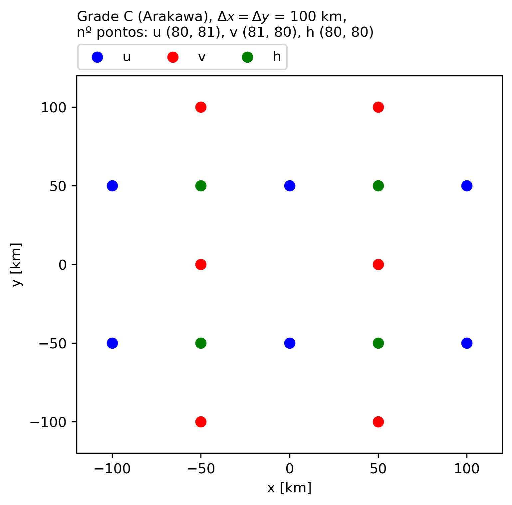{width=50%} 
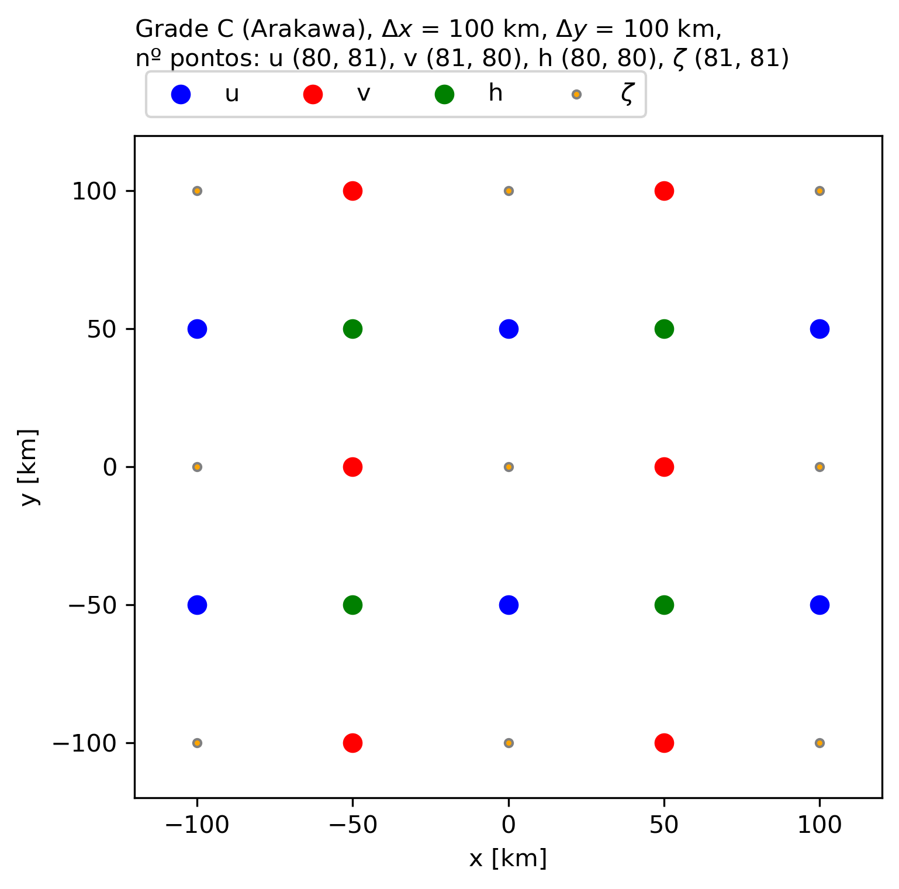{width=50%}
\begin{figure}[!h]
\caption{Configuração da grade C tipo Arakawa usados para os experimentos dos exercícios 4 e 5, respetivamente.}
\label{fig:gradeC}
\end{figure}

# 2. Descrição da metodologia
O exercício considera três condições no parâmetro de Coriolis (f=0 como cenário 'scen1', f=$f_0$ na latitude 20°S como cenário 'scen2' e f=$\beta$y para o plano beta equatorial como cenário 'scen3').
O desenho da grade C foi feito no programa Python e gerou três tipos de matrizes que estão distribuídos espacialmente como mostra a @Fig:gradeC, usados para os experimentos dos exercícios 4 e 5.
Esta grade é muito utilizada nos modelos numéricos atmosféricos e é chamada assim porque os pontos da grade são distribuídos espacialmente na forma da letra "C".
Nela podemos ter a matrix $h$ com 80 $\times$ 80 pontos com variação espacial desde -4000 km até 4000 km. As duas seguintes apresentam matrizes para os componentes zonal (u) e meridional (v) com pontos adicionais nos eixos X e Y, respetivamente.
A opção de fonte escolhida é de tipo oceanográfico de momentum zonal constante com ventos de leste, com gaussiana centrada no equador e alongada na direção zonal (@Fig:fontes (b)), definida pela @eq:Fu.
Para o exercício 5 também temos assinações para as condicões iniciais (@Fig:fontes (c) e (d)).

$$ Fu = \exp\left(\frac{-Xu^2}{(Nrx.\Delta x)^2}-\frac{Yu^2}{(Nry.\Delta y)^2}\right)\frac{1}{24*3600} $${#eq:Fu}

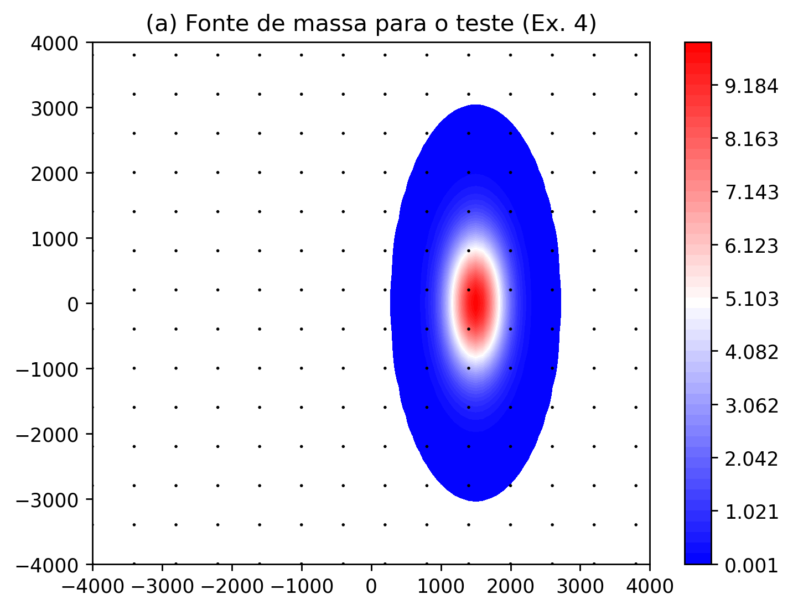{width=50%}
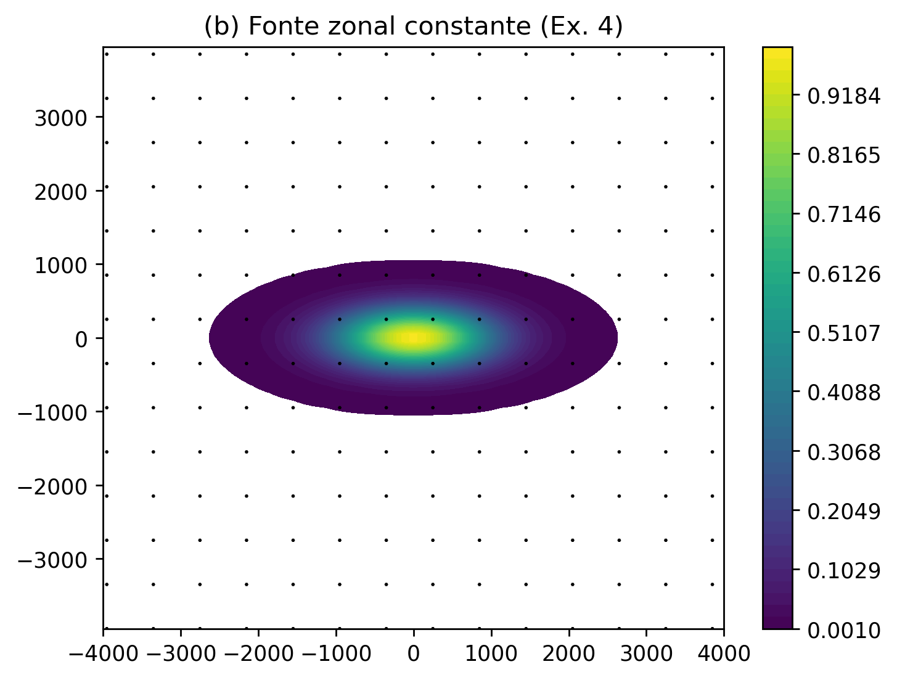{width=50%}
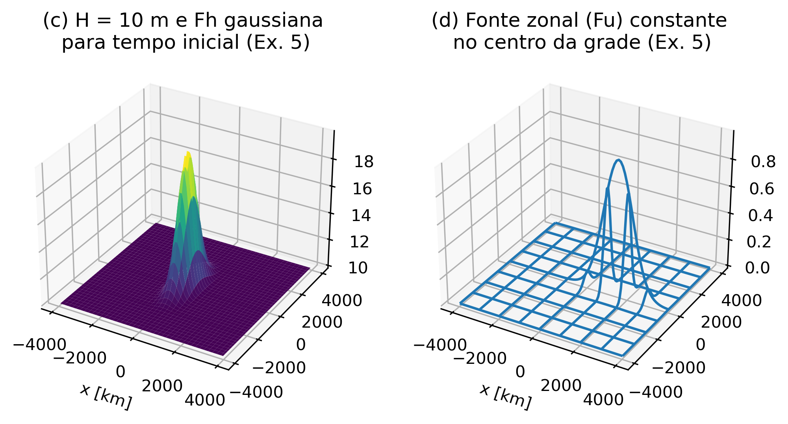{width=100%}
\begin{figure}[!h]
\caption{Fontes de massa e zonal consideradas para a integração no modelo de água rasa. (a) Fonte de massa (Fh) como condição inicial para o teste de simetria do (Ex. 4), (b) Fonte zonal constante para o caso oceanográfico (Ex 4), (c) Fonte de massa gaussiana e elevação (Fh + H) e (d) fonte zonal constante no centro da grade (Ex. 5).}
\label{fig:fontes}
\end{figure}

Onde $Xu$ e $Yu$ são os pontos na direção x e y da componente zonal ($u$), $Nrx$ e $Nry$ são pontos na direção x e y para definir o alongamento da fonte zonal $Fu$.
Ela representa escoamentos dos ventos do oeste no domínio em direção leste.
Na simulação de água rasa não linearizado considera-se uma diminuição da forçante cada 24 horas até o dia 100. 
Antes de iniciar as integrações, três testes de simetria foram conduzidas para avaliar o código implementado em Python e as condições radiacionais nas bordas norte, sul e oeste.
O teste de simetria considera somente uma fonte de massa no tempo inicial com $H$ = 250 m para 5 dias de simulação. A resolução espacial horizontal é de $\Delta x = \Delta y = 100$ km.

Posteriormente ao teste de simetria, a simulação do caso oceanográfico para os três cenários considerou o período de 10 dias para o Ex. 4 e 100 dias para o Ex. 5, com um $\Delta t = 60$ segundos. Os esquemas numéricos usados foram o Leap-frog e Lax-Wendroff. Os passos para rodar os experimentos foram baseados nas sugestões de @Doos2020:

- As condições iniciais (CI) foram estabelecidas para $n=0$ para todos os indices $i$ e $j$ numa grade tipo C: $u^{n=0}_{i+1,j}$ = 0, $v^{n=0}_{i,j+1}$ = 0, $h^{n=0}_{i,j}$ = 0. No caso do código em Python, a programação foi feito com o módulo `numpy`. O chamado dos indexes neste módulo é diferente no estilo `un[j, i]` onde *`i`* é a variação no eixo X (filas) e *`j`* no eixo Y (colunas).
- O código em Python para a construção do modelo de água rasa foram definidos variáveis seguintes: passo de tempo anterior "n-1" (**`unm1`**, **`vnm1`**, **`hnm1`**), passo atual "n" (**`un`**, **`vn`**, **`hn`**) e passo futuro "n+1" (**`unp1`**, **`vnp1`**, **`hnp1`**).
- O primeiro passo de tempo (n = 1) foi integrado com o esquema "Euler-forward", os demais passos de tempo foram aplicados com Leapfrog ou Lax-Wendroff.
- Os resultados da integração foram salvados cada 60 segundos para o Ex. 4 e cada 1 dia para o Ex. 5. 
- Também foram calculados o volumem, energia total e vorticidade ao quadrado para cada passo de tempo. 
- Finalmente, foram gerados mapas de divergência e vorticidade.

A programação da discretização das equações foi escrita em código de Python, disponível no GitHub "Modelagem" do autor, Exercício 4 e 5, [functions.py](https://github.com/adelgadop/Modelagem/blob/main/Exercicio_4_5/functions.py).

## 2.1 Teste de simetria e do radiacional nas fronteiras sul, norte e oeste
O teste de simetria considerou simular uma fonte de massa inicial definida na @eq:Fh, 

$$ Fh = 10*\exp\left(\frac{-(Xh -15\Delta x)^2}{(4\Delta x)^2}-\frac{Yh^2}{(10~\Delta y)^2}\right),$${#eq:Fh}

onde a borda leste é rígida e se comporta como uma parede, enquanto as demais são abertas ou radiacionais que permitem o passo das ondas com pequenas reflexões de ondas curtas.
Podemos observar na @Fig:teste_rad que na integração no dia 1 (esquerda), existe uma reflexão na parte leste, depois no dia 2 a primeira onda saiu fora do domínio oeste com reflexões de ondas curtas no sentido na direção leste, muito mais visível para o cenário 'scen1' com f = 0.

Ao longo da integração, também foram salvados os dados de massa e energia para os três cenários como podemos observar na [@Fig:teste_cons].
A massa diminui até antes do final do primeiro dia para o primeiro cenário, com aumentos no segundo dia quando a primeira onda sai fora do dominio oeste e com reflexões para o sentido leste.
O cenário 2 'scen2' (f em -20°S) mantém a quantidade de massa com decréscimos e acréscimos que pode estar relacionado com a presença da massa formada com vorticidade gerada.
O cenário 3 'scen3' também tem um comportamento parecido com decréscimos e acréscimos na massa com tendencia na diminuição até terminar a integração. 
A energia cinética também diminui até valores de zero para todos os cenários, começando desde o final do dia 2 até o fim da integração.

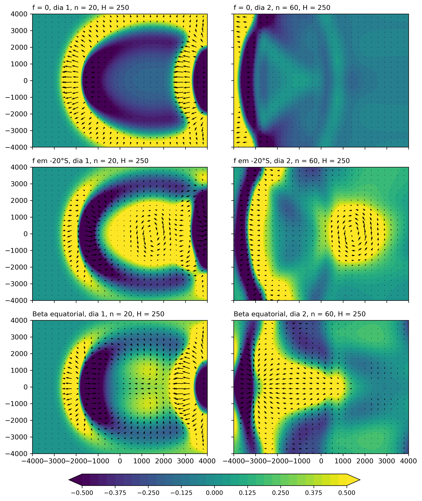{#fig:teste_rad}

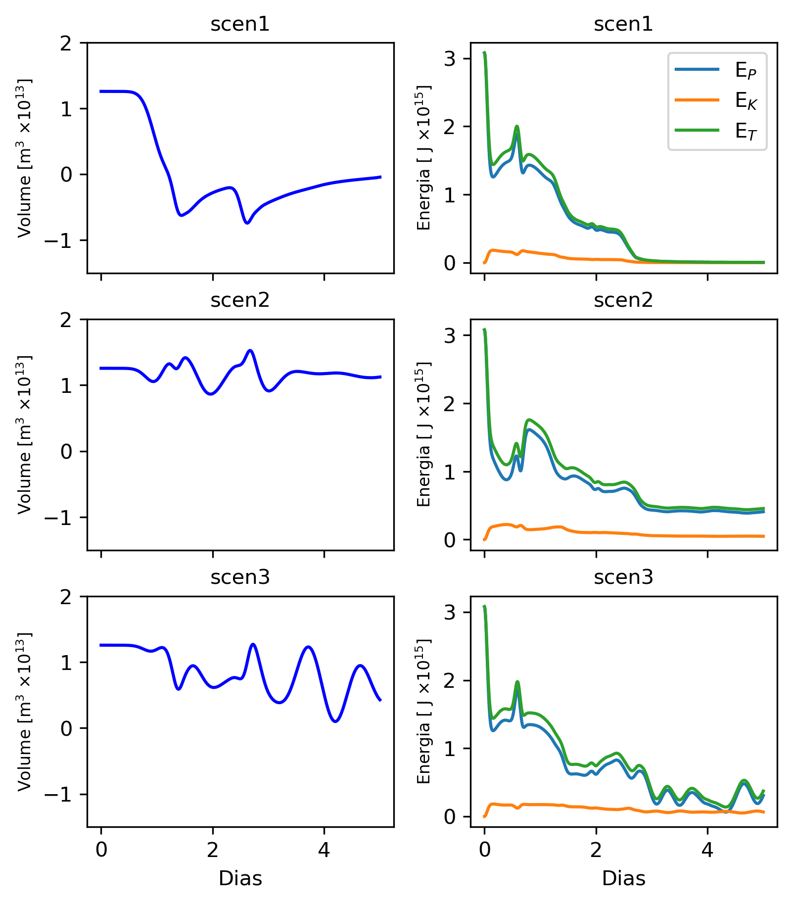{#fig:teste_cons}

# 3. Resultados

# 3.1 Modelo de água rasa linearizado (Ex. 4)
Os resultados de variação de 'h' e os ventos para o caso da fonte de momentum zonal constante são mostrados na @Fig:lin para diferentes valores de Coriolis (f = 0, f constante para a latitude 20°S e variação de f no plano beta equatorial) para os dias 2 e 8. 
Os mapas de divergência e vorticidade são apresentados na @Fig:lin_div para o dia 6 e cenário. 
No equador podemos notar que os valores são nulos. 
No cenário 2 'scen2' (f para -20°S) a variação dos valores divergentes e de vorticidade são complementários no domínio todo.
A @Fig:cons mostra o volume e energia total dos resultados de simulação para cada cenário.
O volume apresenta um comportamento constante ao longo do tempo com exceção do cenário 1 com acréscimos depois do dia 5.
A energia potencial ($E_P$) aumenta devido à fonte zonal (Fu) constante que acrescenta as variações positivas de 'h' na direção leste.
A energia cinética ($E_K$) tem valores de zero ao longo da integração do tempo.

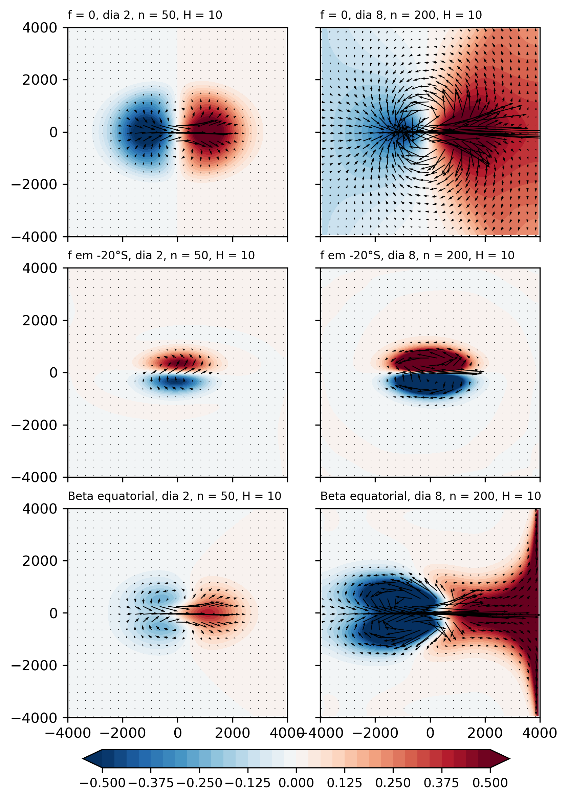{#fig:lin}

\begin{figure}[htbp]
\includegraphics[width=.75\textwidth, height=!]{fig/lf_div_vor10m.png}\centering
\caption{Modelo de água rasa linear: Mapas da divergência e vorticidade para os diferentes cenários: 'scen1' (f = 0), 'scen2' (f constante na latitude -20°S) e 'scen3' (plano beta equatorial).}
\label{fig:lin_div}
\end{figure}

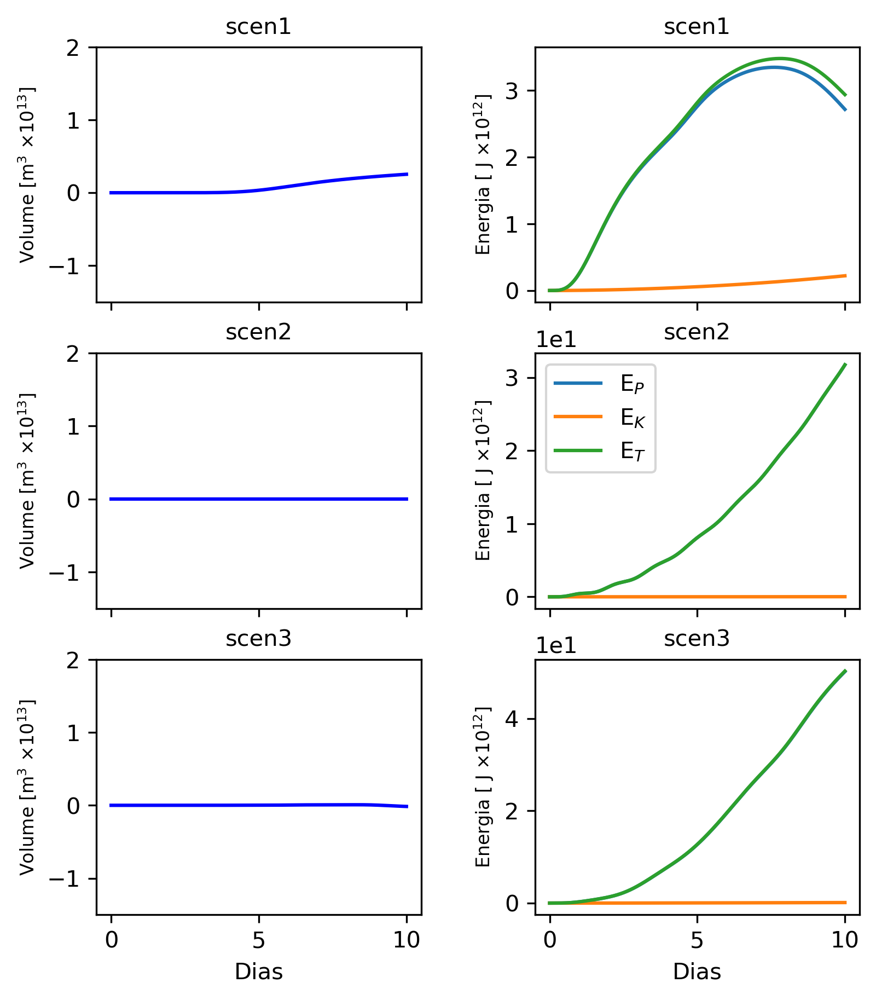{#fig:cons}

# 3.2 Modelo de água rasa não linearizado (Ex. 5)
A @Fig:nlin  @Fig:nlin_div

A @Fig:cons_nl

\begin{figure}[htbp]
\includegraphics[width=1\textwidth, height=!]{fig/lf_ex5_10m_scen3_Fu.png}\centering
\caption{Modelo de água rasa não linear: Variação de h - H com fonte de momentum zonal (Fu) para o cenário 'scen3' (plano beta equatorial). Onde H = 10 m para um tempo de integração de 100 dias e tempo de resolução $\Delta t$ = 60 s.}
\label{fig:nlin}
\end{figure}

\begin{figure}[htbp]
\includegraphics[width=1\textwidth, height=!]{fig/lf_ex5_div_vor10m_scen3.png}\centering
\caption{Modelo de água rasa não linear: Mapas da divergência e vorticidade para os diferentes cenários para o 'scen3' (plano beta equatorial).}
\label{fig:nlin_div}
\end{figure}

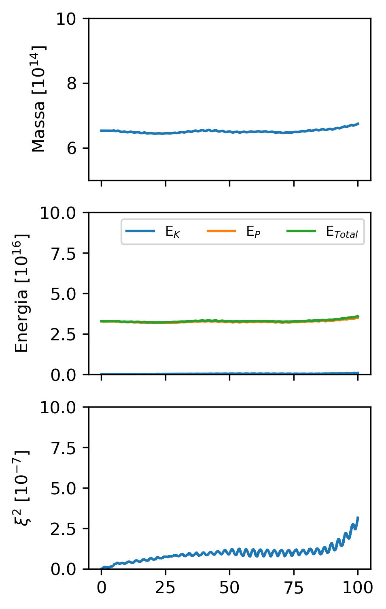{#fig:cons_nl}

# 4. Discussão dos resultados

# Bibliografia

\appendix
# Apêndice A: Material suplementar
