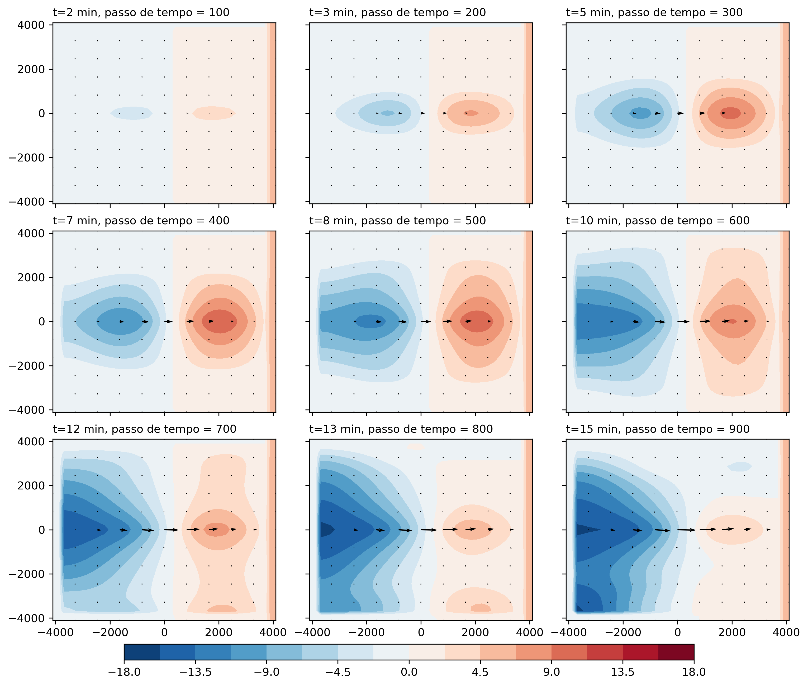

# Modelagem Atmosférica - 2o semestre 2022
Exercicíos desenvolvidos em Python como parte dos estudos de doutorado em meteorologia.
## Exercicío 1
- [x] Resolver problema de transporte de um pulso inicial de poluição numa situação em que o vento seja constante.
   - [x] Desenvolver as soluções numéricas: Malha de espaçamento, condição inicial, U = 10 m/s. Integrar durante o tempo suficiente para que perturbação inicial volte para a parte central da malha no caso da fronteira periódica; demais casos, integrar até que a perturbação chegue totalmente na fronteira.
   - [x] Solução analítica para função Gaussiana
   - [x] Solução analítica para função retângulo.
   - [x] Método de solução
     1. [x] Inicie com um esquema de ordem 1 (cuidado com a estabilidade do esquema na escolha do delta t na derivada espacial).
        1. [x] Periódica (ok)
     2. [x] Compare a solução dada em 1 com um esquema leapfrog de ordem 2 (espaço e tempo)
        1. [x] Fixa (ok)
        2. [x] Periódica (ok)
        3. [x] Radiacional (ok)
     3. [x] Modifique a derivada no espaço para um esquema de 4a ordem (será necessário manter a segunda ordem no ponto imediatamente vizinho da fronteira no caso da CF fixa).
        1. [x] Periódica
     4. [x] Use também um método iterativo, por exemplo, o `Esquema Matsuno`.
        1. [x] Periódica
     5. [x] Use um `método implícito` (e.g., Crank-Nicolson scheme).
        1. [x] Periódica
     6. [x] Finalmente, use um Runge Kutta de 4ª ordem no tempo com um esquema de 4to ordem no espaço
        1. [x] Periódica
     
     Obs: quanto a CF, não é necessário fazer os 3 casos (fixa, radiacional e periódica) para todos os experimentos. Faça apenas para o caso Leapfrog. Nos demais, faça sempre a CF periódica.
     
- [x] Apresentar o exercício na forma de um "paper": introdução, metodologia, resultados e discussão dos resultados.    
  - Para gerar o pdf usando pandoc:
   `pandoc -V lang=pt -H format.sty paper.md --filter pandoc-crossref --citeproc -o paper.pdf`
  - [x] Introdução
  - [x] Metodologia
  - [x] Resultados e discussão
  - [x] Conclussões preliminares
---
## Exercicío 2
Vamos supor que você tenha uma fonte de poluição pontual (pe. uma chaminé) que emite em forma de pulso senoidal (definido abaixo) com o mesmo campo básico U = 10 $m.s^{-1}$ do exercício 1 (eq. da advecção linearizada). Por tanto, a equação que governa este problema é dado por:

$\frac{\partial C}{\partial t}+U \frac{\partial C}{\partial x}=F$ onde $F=F(x,t)$

$F(i=100, n\Delta t)= sin(\omega .n\Delta t)$ para n = 0, ... N$_{max}$ se $sin(\omega .n.\Delta t) > 0$

$F(i=100, n\Delta t)=0$ caso $sin(\omega .n\Delta t)< 0$ como $\omega = \frac{2\pi}{1800}$ $s^{-1}$
- [x] Discuta a forma da solução analítica no diagrama de Hovmoller (x,t)
- [x] Resolva numéricamente com os esquemas:
  - [x] (a) Avançado no tempo atrasado no espaço
  - [x] (b) Leapfrog 2ª ordem
  - [x] (c) 4ª ordem no espaço
  - [x] (d) Implícito (e.g., Crank-Nicolson)
  
com a mesma malha do `Exercício 1`. Porém, use uma CI identicamente nula em todo o domínio e com a fonte da grandeza $F$ dada pela expressão acima no ponto central da malha.
Como condição de fronteira do lado direito da malha, no caso Leapfrog e 4ª ordem, a solução dada pelo esquema de 1ª ordem (a). Observe que este esquema permite que a perturbação passe pela fronteira, sem reflexão.
- [x] (e) É realista a solução no caso Leapfrog e 4ª ordem? Explique por qué a concentração não é nula à esquerda da fonte. Como tornar o resultado mais realista? (dica... filtragem...)
- [x] (f) O que acontece com o método implícito? Observe que é incondicionalmente estável. Portanto, o $\Delta t$ pode tornar o CFL > 1 e manter a estabilidade. O que acontece com a solução a medida que $\Delta t$ aumenta acima de 1 (experimente com CFL=2, 4...)

- [x] Apresente o exercício na forma de um "paper", ou seja:
  - [x] Introdução sobre o tema
  - [x] Descrição da metodologia,
  - [x] Resultados
  - [x] Discussão dos resultados. 

Para gerar o pdf usando pandoc:
   `pandoc -H format.sty paper.md --filter pandoc-crossref --citeproc -o paper.pdf`
#### Dica
Explorar modo computacional no espaço, liga a fonte o vento vai transportar na direção. Vai aparecer concentrações negativas na retaguarda. A ideia é explorar os filtros no espaço. Alguns esquemas precisam filtros no espaço e no tempo.

**Pegadinha**: A fonte tem uma oscilação fonte é positiva. Ficar atento no valor 1800, que impacta o CFL, não vai representar a fonte.

**Brincadeira**: Cada 1800 vai emitir a chaminé. O objetivo é $\Delta t$ pensar no fenómeno. Cuidado com o esquema implícito na relação $\Delta t$ e CFL.

## Exercício 3
> Problema No. 3  - Advecção com difusão e forçante 
> Apresentação dos resultados em **(12/10/2022)**

Vamos simular uma situação mais realista do Problema 2 (advecção com fonte do poluente) ao introduzir o efeito da difusão. Portanto, a equação que governa este problema é dada por:

$\frac{\partial C}{\partial t} + U \frac{\partial C}{\partial x} = K \frac{\partial^2C}{\partial x^2} + F$

Use a mesma fonte periódica do Ex 2, mesma malha no espaço e determine o K (kappa) de forma que o tempo de decaimento seja da ordem de 3 horas. Inicialmente coloque o F no tempo n. Faça o 

$\frac{\partial C}{\partial t} \rarr \frac{(C^{n+1} - C^{n-1})}{2 \Delta t}$

Mantenha a CF radiacional do Ex 2. 

- [x] a. Resolva numericamente com o esquema Leapfrog na advecção e a difusão no tempo n-1, forcante no tempo n-1.
- [x] b. Introduza a forçante pelo método splitting
  - [x] 1. Verifique experimentalmente o critério discutido em Doos et al. Figura 8.6  para a estabilidade numérica do esquema, através de variações do U e K (kappa) com F = 0
  - [x] 2. Com o F do Problema 2, discuta o efeito do splitting. Ou seja, compare a solução com o F calculado no tempo n-1 com a solução em 2 passos. No primeiro passo  (\*) calcule somente o efeito da advecção e difusão e no segundo passo calcule a forçante com a estimativa  no primeiro passo (\*).

Apresente o exercício na forma de um paper, ou seja,  com uma 
- [x] introdução sobre o tema, 
- [x] descrição da metodologia, 
- [x] resultados e 
- [x] discussão dos resultados.  Pode retirar toda a discussão teórica  sobre a advecção e forçante. Foque na difusão e na questão da forma de introduzir a forçante.

## Exercício 4 - Água Rasa 2D
Entrega do trabalho  + apresentações nos dias 28/10/2022

---
O modelo de água rasa é usado na modelagem atmosférica e oceanográfica para uma enorme variedade de problemas.  Na atmosfera, por ex., uma fonte de calor na atmosfera (por exemplo, um furacão) pode ser vista como uma fonte de massa no modelo de água rasa.  No oceano, o gatilho para formação do ENSO pode ser representado por uma transferência de momentum na componente zonal do vento da região equatorial, representativa do efeito de um transiente na intensidade dos ventos alísios.  Como esses problemas são altamente dependentes da capacidade do modelo descrever o processo de dispersão de energia, vamos fazer simulações com o modelo de água rasa 2D:

$\frac{\partial u}{\partial t}+u\frac{\partial u}{\partial x} + v\frac{\partial u}{\partial y} - fv + \frac{\partial \phi}{\partial x} = F_u$

$\frac{\partial v}{\partial t}+u\frac{\partial v}{\partial x} + v\frac{\partial v}{\partial y} - fu + \frac{\partial \phi}{\partial y} = F_v$

$\frac{\partial \phi}{\partial t}+u\frac{\partial \phi}{\partial x} + v\frac{\partial \phi}{\partial y} +\phi.Div(V) = F_{\phi}$

Onde $F_u$, $F_v$, $F_{\phi}$ representam fontes de momentum zonal, meridional e massa, respectivamente.

a. Resolva em 2D o modelo de água rasa (1) na versão linear, com estado básico U = 0, supondo que 
- i. f = 0
- f = f$_o$ = constante (assuma que a latitude é 20°S)
- f = $\beta$y (ou seja, o plano beta equatorial). Suponha que a latitude máxima seja de +/- 4000 km, com dx=dy=100 km. Na longitude também considere o domínio +/- 4000 km.
- Opções de fonte (um problema meteorológico e outro oceanográfico) - escolha uma deles:
   - $\bf A.$ Aplique a fonte de massa na atmosfera constante no tempo. A estrutura espacial da fonte é dada por uma Gaussiana (use Nr$_x$=Nr$_y$= 4 e 10 - isto é, fonte pequena e fonte grande). Considere que a fonte esteja centrada na latitude de +1500 km e longitude 0 (centro da malha em x). Use o domínio horizontal de 8000 km. Use CF aberta radiacional nas fronteiras. Utilize `H=250` m e integre por 3 dias.
   - $\bf B.$ Fonte de momentum zonal, constante (vento forçante de leste), com gaussiana centrada no equador, alongada na direção zonal. (Nr$_x$=10 e Nr$_y$=4) para representar a troca de momentum (representado o processo de formação do ENSO). Centre a fonte de momentum na longitude 0. Use CF radiacional na fronteira oeste, norte e sul e CF rígida na fronteira leste. Use `H = 1 m` (sim, um metro!). Integre até que a onda que vai para leste atinja a costa e comece a refletir para o centro da grade. Como vai demorar muito tempo, faça os testes do modelo com `H = 250 m`. Só depois que você tiver removido todas as "funcionalidades não documentadas" do modelo (i.e., os "bugs"), faça uma integração com o H mais realista.

b. Discuta os resultados (do ponto de vista da dispersão de energia) e as diferenças entre os métodos numéricos. Use pelo menos 2 esquemas numéricos de integração no tempo (um deles deve ser o leapfrog). Use a grade C.

c. Em todos os casos acima, verifique a conservação de massa e de energia e faça mapas da divergência e vorticidade. Discuta as diferenças entre os métodos numéricos.

d. Observe que como o modelo é linear, a magnitude da fonte de massa ou de momentum (dada pela amplitude da gaussiana) é irrelevante. Considere a fonte com magnitude máxima unitária.

e. E divirta-se...

Faça o relatório do Ex. 4 na forma de artigo.

